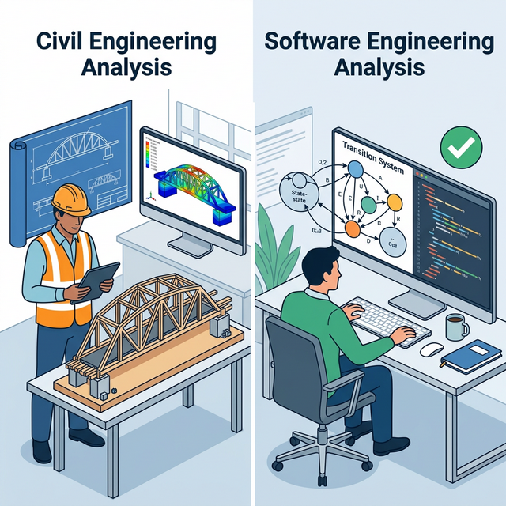
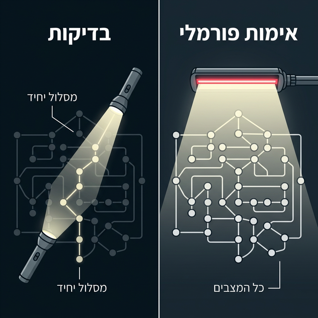
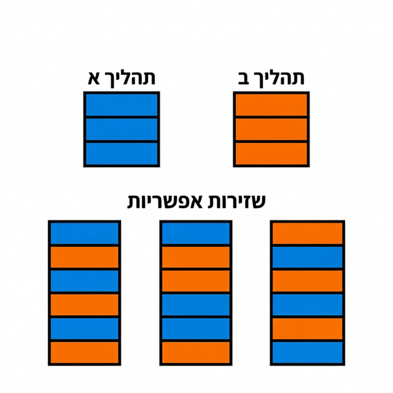
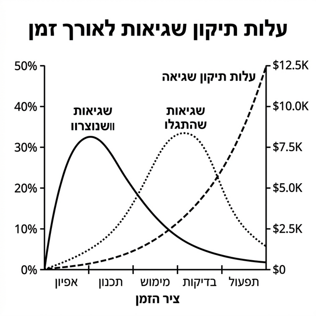

 
# מבוא לאימות תוכנה    בשיטות פורמאליות
הפקולטה למדעי המחשב והמידע | אוניברסיטת בן-גוריון

**גרא וייס**

---

# מידע כללי ℹ️

* **מרצה:** גרא וייס

* **משרד:** חדר 123 בבניין 37
* **שעות קבלה:** ימי רביעי, 14:00-16:00 
* **דוא"ל:** geraw@bgu.ac.il
* **אתר הקורס:** [מודל](https://moodle.bgu.ac.il/moodle/course/view.php?id=58529)

---

# מרכיבי הציון 🎓

| רכיב | משקל | הערות |
| --- | --- | --- |
| עבודות תכנותיות | 10% |  |
| עבודות עיוניות | 10% |  |
| **בוחן אמצע** | 20% | מתוכנן להתקיים ב-1/5/26 |
| **מבחן סופי** | 60% |  |
| עבודות בונוס | +2% | לכל עבודה |

> **תנאי מעבר:** מעבר בוחן ומבחן, והגשת 80% מתרגילי הבית.
> **השקעה נדרשת:** 5-10 שעות עבודה עצמית בשבוע.

---

# לוגיקה בפעולה 🧠

* **שורשים פילוסופיים:** הבנת תהליכי הסקת מסקנות אנושיים ותיאורם המדויק.
* **בעידן המחשב:**
    * בסיס למעגלים לוגיים.
    * פיתוח מנגנונים לניתוח לוגיקת תוכנה.
    * גילוי שגיאות לוגיות בתכנון ובמימוש.

  

---

# מהן שיטות פורמליות? 🛠️

טכניקות **מתמטיות ואלגוריתמיות** לאפיון, פיתוח ואימות תוכנה וחומרה אמינה.

  

    <ul class="space-y-4">
      <li><strong>מוטיבציה:</strong> אנליזה מתמטית מסודרת תורמת ליציבות התכנון (כמו בכל הנדסה).</li>
      <li><strong>שימוש כיום:</strong> בעיקר במערכות קריטיות (בטיחות ואמינות גבוהה) בשל עלות ומורכבות.</li>
    </ul>
  

  

    
  

---

# בדיקות (Testing) vs. אימות פורמאלי (Verification) 🔍

  

    
     
      <strong>בדיקה רגילה:</strong> נבדק מסלול פעולה יחיד עבור קלט נתון.
    

    

      <strong>אימות פורמאלי:</strong> סריקת <strong>כל</strong> מצבי המערכת עד גילוי שגיאה או הוכחת נכונות.
    

  

  

    
  

---

# : שזירת תהליכים (Threads Interleaving) 🧵

  

במערכות מקביליות, מספר הריצות האפשריות ($M$) גדל אקספוננציאלית:

$$M = \frac{(\sum_{i=1}^{N} n_i)!}{\prod_{i=1}^{N} (n_i!)}$$

<ul class="space-y-4">
  <li>כל מלבן באיור מייצג <strong>פעולה אטומית</strong> של thread.</li>
  <li>אימות פורמאלי נועד לצוד באגים במרחב המצבים העצום שנוצר מהשזירות.</li>
</ul>
  

  

    
  

---

# "צייד באגים" - חשיבות הגילוי המוקדם 🐛

  

    ככל ששגיאה מתגלה מאוחר יותר בציר הזמן, עלות התיקון שלה מזנקת:
    
<ul class="mt-6 space-y-4">
  
  <li><strong>אפיון ותכנון:</strong> עלות נמוכה, קל לתקן.</li>
  <li><strong>בדיקות ותפעול:</strong> עלות שמגיעה לאלפי דולרים ($12.5K+) לשגיאה.</li>
</ul>
    
<blockquote>
  <strong>מסקנה:</strong> אימות פורמלי בשלב התכנון חוסך הון!
</blockquote>

---

# תוכנית הקורס 📚

1. **מערכות מעברים (Transition Systems):** תיאור תוכנה כגרף תוכנית.
2. **שפת Promela:** תיאור מערכות מבוזרות.
3. **לוגיקת זמן (Temporal Logic):** אפיון תכונות דינמיות.
4. **בדיקות מודל (Model Checking):** אלגוריתמים לאימות אוטומטי.

---

# דוגמאות לאסונות שניתן היה למנוע ⚠️

* **Therac-25:** קרינת יתר קטלנית עקב Race Condition בתוכנה.
* **AT&T Network:** נפילת רשת ל-9 שעות עקב פירוש שגוי של פקודת `break` ב-C.
* **Ariane 5:** התרסקות טיל שעלתה 500 מיליון אירו עקב טעות בהמרת משתנה (Overflow).
* **Intel Pentium:** שגיאת FDIV בחילוק נקודה צפה שעלתה 500 מיליון דולר.

---

# אימות (Verification) ≠ תִּקּוּף (Validation) ✅

* **אימות:** "האם אנחנו בונים את הדבר **נכון**?" (עמידה בדרישות).
* **תִּקּוּף:** "האם אנחנו בונים את הדבר **הנכון**?" (האם זה מה שהלקוח צריך).

---

# שיטות לאימות פורמאלי 🧩

* **שיטות דדוקטיביות:** הוכחה מתמטית של נכונות (Theorem Provers).
* **בדיקות מודל (Model Checking):** בדיקה ממוכנת של כל ריצה אפשרית במכונת מצבים.
* **סימולציה:** בדיקת $P$ על ידי הפעלת התנהגויות (לא מבטיח הוכחה מלאה).

---

# אבני דרך בהיסטוריה 📜

* **1940:** הוכחה מתמטית ידנית (טיורינג).
* **1969:** לוגיקת הואר (Hoare) לתוכנות סדרתיות.
* **1977:** אמיר פנואלי מכניס את לוגיקת הזמן (פרס טיורינג 1996).
* **2008:** פרס טיורינג לקלארק, אמרסון וסיפאקיס על פיתוח Model Checking.

---

# כלי ה-SPIN ומרחב המצבים 🤖

* **SPIN:** כלי לניתוח מודלים מבוזרים ומקביליים.
* **פרויקט הקורס:** פיתוח כלי דומה ל-SPIN.
* **דוגמה:** בחינת תהליכי Inc, Dec ו-Reset על משתנה $x$ ובדיקת חריגות מהטווח $0 \le x \le 200$.