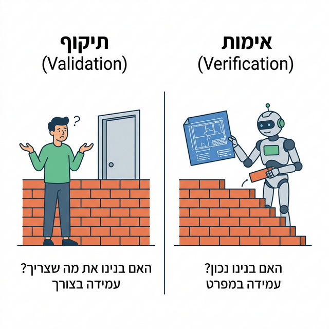
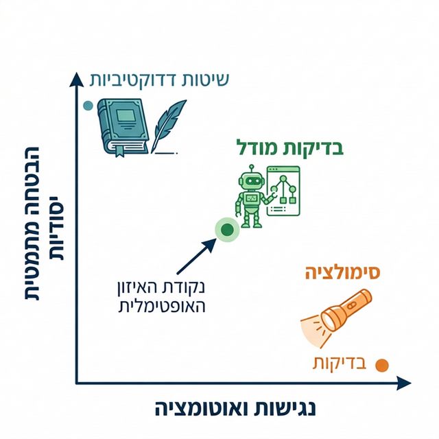
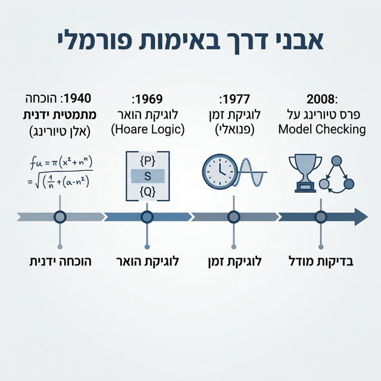
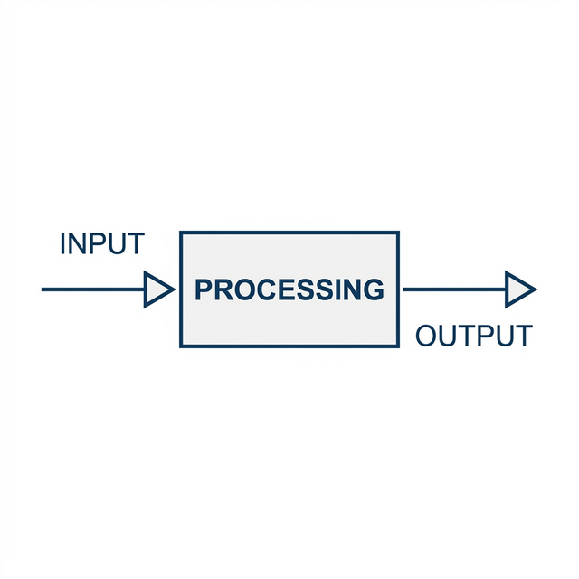
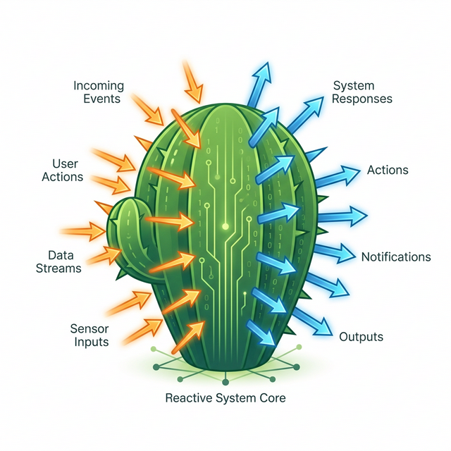

 
# מבוא לאימות תוכנה    בשיטות פורמאליות
הפקולטה למדעי המחשב והמידע | אוניברסיטת בן-גוריון

**גרא וייס**

---

# מידע כללי ℹ️

* **מרצה:** גרא וייס

* **משרד:** חדר 123 בבניין 37
* **שעות קבלה:** ימי רביעי, 14:00-16:00 
* **דוא"ל:** geraw@bgu.ac.il
* **אתר הקורס:** [מודל](https://moodle.bgu.ac.il/moodle/course/view.php?id=58529)

---

# מרכיבי הציון 🎓

| רכיב | משקל | הערות |
| --- | --- | --- |
| עבודות תכנותיות | 10% | שתי עבודות הכוללות לימוד עצמי באמצעות LLM .אפשר בזוגות. |
| עבודות עיוניות | 10% | ארבע עבודות הכוללות תרגילי רשות וחובה ברמה של הבוחן והמבחן. הגשה אישית. |
| **בוחן אמצע** | 20% | מתוכנן להתקיים ב-1/5/26 |
| **מבחן סופי** | 60% | מתוכנן להתקיים ב-8/7/26 (מועד א') וב-5/8/26 (מועד ב')|

> **תנאי מעבר:** מעבר בוחן ומבחן, והגשת כל תרגילי הבית.
> **השקעה נדרשת:** 5-10 שעות עבודה עצמית בשבוע.

פירוט מתווה המילואים מופיע בשקף הבא.

---

# למשרתי ומשרתות המילואים

  

    מעבר למתווה הכללי של האוניברסיטה, ננסה לסייע לכם בקורס בהיבטים הבאים:
  

  

    

      
השלמת חומר והרצאות

      

        אם החומר באתר (סיכומי הרצאות, מצגות, הרצאות מוקלטות) ושעות הקבלה הרגילות אינם מספיקים,
        אפשר לקבוע איתי (<a href="mailto:geraw@bgu.ac.il">geraw@bgu.ac.il</a>) פגישה אישית להשלמת הפערים.
      

    

    

      
תרגולים ועבודות תכנותיות

      

        אם החומר באתר ושעות הקבלה הרגילות של המתרגלים אינם מספיקים, אפשר לפנות למתרגלים להשלמת פערים.
        שתי העבודות התכנותיות מוגשות בזוגות, בהתאם לשקף מרכיבי הציון.
      

    

    

      
הארכות

      

        לכל משרת מילואים על פי סיווג האוניברסיטה ניתנת הארכה ללא הגבלה לכל העבודות.
        היא חלה גם על השותף בזוג.
        בקשות להארכות יש לשלוח לטל בראמי (<a href="mailto:baramit@post.bgu.ac.il">baramit@post.bgu.ac.il</a>), המתרגל האחראי בקורס.
      

    

  

  

    
פטורים וחישוב ציון מיטבי

    

      
 
        
עבודות תכנותיות: 2 עבודות בזוגות

        
לקבוצות 2-3 פטור על עבודה תכנותית אחת; גם השותף בזוג נהנה מאותו מתווה.

        
אם העבודה לא תוגש: משקל העבודה התכנותית האחרת יהיה 7.5% עבור קבוצה 2 ו-10% עבור קבוצה 3.

        
אם העבודה תוגש למרות הפטור: בחישוב הציון תילקח בחשבון העבודה הגבוהה מבין השתיים, במשקל 10%.

        
עבור משרת/ת מילואים בלבד מקבוצה 3, משקל שתי העבודות התכנותיות יכול להגיע ל-15% מהציון הסופי.

      

      

        
עבודות עיוניות: 4 עבודות אישיות

        
לקבוצות 2-3 ניתן לקבל פטור על עבודה עיונית אחת.

        
אם העבודה לא תוגש: משקל שלוש העבודות העיוניות האחרות יהיה 7.5% עבור קבוצה 2 ו-10% עבור קבוצה 3.

        
אם העבודה תוגש למרות הפטור: בחישוב הציון יילקחו בחשבון שלוש העבודות הגבוהות מבין הארבע, במשקל 10%.

        
עבור משרת/ת מילואים בלבד מקבוצה 3, משקל ארבע העבודות העיוניות יכול להגיע ל-15% מהציון הסופי.

      

    

  

ככלל, ההמלצה היא לנסות להגיש את כל העבודות, כי זה חיוני להבנת החומר ולהצלחה במבחן.

הגשת העבודה למרות הפטור לא תפגע בציון: ייבחר הציון האופטימלי מבין כל האפשרויות.

מי שמסווג/ת לקטגוריית 300+ ישודרג/תשודרג ברמה אחת לצורך מתווה זה; למשל, קבוצה 2 תיחשב כקבוצה 3.

---

# מהן שיטות פורמליות? 🛠️

טכניקות **מתמטיות ואלגוריתמיות** לאפיון, פיתוח ואימות תוכנה וחומרה אמינה.

  

    <ul class="space-y-4">
      <li><strong>מוטיבציה:</strong> אנליזה מתמטית מסודרת תורמת ליציבות התכנון (כמו בכל הנדסה).</li>
      <li><strong>שימוש כיום:</strong> בעיקר במערכות קריטיות (בטיחות ואמינות גבוהה) בשל עלות ומורכבות.</li>
    </ul>
  

  

    
  

---

# לוגיקה בפעולה 🧠

* **שורשים פילוסופיים:** הבנת תהליכי הסקת מסקנות אנושיים ותיאורם המדויק.
* **בעידן המחשב:**
    * בסיס למעגלים לוגיים.
    * פיתוח מנגנונים לניתוח לוגיקת תוכנה.
    * גילוי שגיאות לוגיות בתכנון ובמימוש.

  

---

# בדיקות (Testing) vs. אימות פורמאלי (Verification) 🔍

  

    
     
      <strong>בדיקה רגילה:</strong> נבדק מסלול פעולה יחיד עבור קלט נתון.
    

    

      <strong>אימות פורמאלי:</strong> סריקת <strong>כל</strong> מצבי המערכת עד גילוי שגיאה או הוכחת נכונות.
    

  

  

    
  

---

# שזירת תהליכים (Threads Interleaving) 🧵

  

במערכות מקביליות, מספר הריצות האפשריות ($M$) גדל אקספוננציאלית:

$$M = \frac{(\sum_{i=1}^{N} n_i)!}{\prod_{i=1}^{N} (n_i!)}$$

<ul class="space-y-4">
  <li>כל מלבן באיור מייצג <strong>פעולה אטומית</strong> של thread.</li>
  <li>אימות פורמאלי נועד לצוד באגים במרחב המצבים העצום שנוצר מהשזירות.</li>
</ul>
  

  

    
  

---

# "צייד באגים" - חשיבות הגילוי המוקדם 🐛

  

    ככל ששגיאה מתגלה מאוחר יותר בציר הזמן, עלות התיקון שלה מזנקת:
    
<ul class="mt-6 space-y-4">
  
  <li><strong>אפיון ותכנון:</strong> עלות נמוכה, קל לתקן.</li>
  <li><strong>בדיקות ותפעול:</strong> עלות שמגיעה לאלפי דולרים ($12.5K+) לשגיאה.</li>
</ul>
    
<blockquote>
  <strong>מסקנה:</strong> אימות פורמלי בשלב התכנון חוסך הון!
</blockquote>

---

# מושגי יסוד שנלמד בקורס  📚

  

    <strong>1. מערכות מעברים (Transition Systems)</strong>
    <ul class="opacity-80">
      <li>מידול התנהגות תוכנה וחומרה באמצעות מצבים ומעברים.</li>
      <li>טיפול באי-דטרמיניזם וריצה מקבילית.</li>
      <li>גרפי תוכנית (Program Graphs) ומשתנים משותפים.</li>
    </ul>
  

  

    <strong>5. תכונות בטיחות וחיות (Safety & Liveness)</strong>
    <ul class="opacity-80">
      <li><strong>Safety:</strong> "משהו רע לעולם לא יקרה" (למשל: אין Deadlock).</li>
      <li><strong>Liveness:</strong> "משהו טוב יקרה בסופו של דבר" (למשל: שירות יינתן).</li>
    </ul>
  

  

    <strong>2. שפת Promela וכלי הבדיקה SPIN</strong>
    <ul class="opacity-80">
      <li>שפה ייעודית למידול מערכות מבוזרות ומקביליות.</li>
      <li>ניהול ערוצי תקשורת (Channels) וסנכרון.</li>
      <li>אימות אוטומטי של מודלים מורכבים.</li>
    </ul>
  

  

    <strong>6. פיצוץ מצבים והפשטה (State Explosion)</strong>
    <ul class="opacity-80">
      <li>התמודדות עם הצמיחה האקספוננציאלית של מרחב המצבים.</li>
      <li>טכניקות צמצום (Partial Order Reduction).</li>
    </ul>
  

  

    <strong>3. לוגיקת זמן (LTL - Temporal Logic)</strong>
    <ul class="opacity-80">
      <li>שפה פורמלית לתיאור דרישות לאורך זמן (Always, Eventually).</li>
      <li>קשר בין לוגיקה לאוטומטים של בוכי (Büchi Automata).</li>
    </ul>
  

  

    <strong>7. הגינות (Fairness)</strong>
    <ul class="opacity-80">
      <li>הנחות על תזמון תהליכים (Weak/Strong Fairness).</li>
      <li>חיוני להוכחת תכונות חיות (Liveness).</li>
    </ul>
  

  

    <strong>4. בדיקות מודל (Model Checking)</strong>
    <ul class="opacity-80">
      <li>אלגוריתמים לסריקה שיטתית של גרף המצבים.</li>
      <li>יצירת דוגמה נגדית (Counter-example) במקרה של שגיאה.</li>
    </ul>
  

---

# אימות (Verification) ≠ תִּקּוּף (Validation) ✅

  

    

      
אימות (Verification)

      "האם אנחנו בונים את הדבר <strong>נכון</strong>?"
      
בדיקה מול המפרט והדרישות הטכניות.

    

    
  

    
תִּקּוּף (Validation)

    "האם אנחנו בונים את הדבר <strong>הנכון</strong>?"
    
בדיקה האם המוצר עונה על הצורך האמיתי של המשתמש.

  

  

  
  

    
  

---

# שיטות לאימות פורמאלי 🧩

  <!-- שיטות דדוקטיביות - למעלה משמאל -->
  

    
שיטות דדוקטיביות (Deductive)

    

      <strong>מהות:</strong> הוכחה מתמטית ידנית או חצי-ממוכנת באמצעות לוגיקה.
      <ul class="mt-2 space-y-1">
        <li>✅ <strong>יתרון:</strong> טיפול במערכות אינסופיות.</li>
        <li>❌ <strong>חיסרון:</strong> דורש מומחיות וזמן רב.</li>
        <li>🛠️ <strong>דוגמה:</strong> Coq, Isabelle, Lean.</li>
      </ul>
    

  

  <!-- בדיקות מודל - במרכז -->
  

    
בדיקות מודל (Model Checking)

    

      <strong>מהות:</strong> סריקה אוטומטית ומלאה של מרחב המצבים.
      <ul class="mt-2 space-y-1">
        <li>✅ <strong>יתרון:</strong> אוטומטי, מספק דוגמה נגדית.</li>
        <li>❌ <strong>חיסרון:</strong> בעיית "פיצוץ המצבים".</li>
        <li>🛠️ <strong>דוגמה:</strong> SPIN, NuSMV, TLC+.</li>
      </ul>
    

  

  <!-- סימולציה - למטה מימין -->
  

    
סימולציה (Simulation)

    

      <strong>מהות:</strong> הרצת המערכת על תרחישים נבחרים (בדיקות דינמיות).
      <ul class="mt-2 space-y-1">
        <li>✅ <strong>יתרון:</strong> מהיר, זול, על המערכת האמיתית.</li>
        <li>❌ <strong>חיסרון:</strong> לא מבטיח הוכחה מלאה.</li>
        <li>🛠️ <strong>דוגמה:</strong> JUnit, Pytest, Simulink.</li>
      </ul>
    

  

---

# למה דווקא בדיקות מודל (Model Checking)? 🎯

  

    
  

  
  

    

      <strong>השילוב המנצח (Sweet Spot):</strong>
      בדיקות מודל משלבות את הדיוק המתמטי של שיטות הוכחה עם האוטומציה של בדיקות תוכנה.
    

    
  <ul class="space-y-3">
    <li>✅ <strong>ללא הוכחות ידניות:</strong> הכלי עושה את העבודה הקשה.</li>
    <li>✅ <strong>כיסוי מלא:</strong> בניגוד לבדיקות, כאן בודקים את <em>כל</em> המצבים.</li>
    <li>✅ <strong>משוב ישיר:</strong> קבלת מסלול מדויק (Counter-example) המראה איך הגענו לבאג.</li>
  </ul>
  
  

    זהו הכלי המעשי ביותר כיום לאימות של מערכות מורכבות ומקביליות.
  

  

---

# התפתחות שיטות אימות 📜

  

  <li><strong>1940:</strong> הוכחה מתמטית ידנית (אלן טיורינג).</li>
  <li><strong>1969:</strong> לוגיקת הואר (Hoare) לתוכנות סדרתיות.</li>
  <li><strong>1977:</strong> אמיר פנואלי מכניס את לוגיקת הזמן (פרס טיורינג 1996).</li>
  <li><strong>2008:</strong> פרס טיורינג לקלארק, אמרסון וסיפאקיס על פיתוח Model Checking.</li>

---

# מערכות סדרתיות vs. מערכות ריאקטיביות 🔄

  

    
מערכת סדרתית (Sequential)

    
    <ul class="text-right space-y-2 text-sm">
      <li>📥 <strong>קלט:</strong> ניתן במלואו בתחילת הריצה.</li>
      <li>⚙️ <strong>עיבוד:</strong> תהליך טרנספורמטיבי (Input to Output).</li>
      <li>📤 <strong>פלט:</strong> מתקבל בסיום הריצה.</li>
      <li>🛑 <strong>סיום:</strong> מצפים מהמערכת לעצור.</li>
    </ul>
  

  

    
מערכת ריאקטיבית (Reactive)

    
    <ul class="text-right space-y-2 text-sm">
      <li>🌵 <strong>מטפורת הקקטוס:</strong> אינטראקציה מתמשכת.</li>
      <li>⚡ <strong>אירועים:</strong> זורמים למערכת באופן שוטף.</li>
      <li>🎯 <strong>תגובות:</strong> המערכת מגיבה לאירועים בזמן אמת.</li>
      <li>🔄 <strong>ריצה:</strong> לרוב אינה אמורה להסתיים (למשל: בקר טיסה).</li>
    </ul>
  

