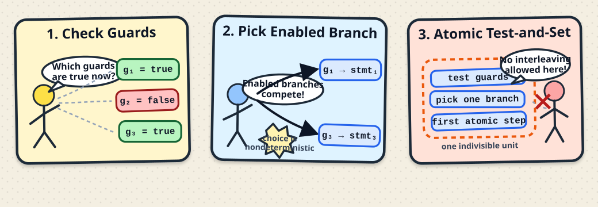

# NanoPromela
## הרצאה בקורס מבוא לאימות תוכנה <br> בשיטות פורמאליות
הפקולטה למדעי המחשב והמידע | אוניברסיטת בן-גוריון

**גרא וייס**


---

# NanoPromela

<div class="text-[15px] leading-snug">

<div class="bg-slate-50 px-4 py-3 rounded border border-slate-200 mt-2">
המודלים שראינו עד עכשיו, כמו <span dir="ltr">program graphs</span>, הרכבה מקבילית
ו־<span dir="ltr">channel systems</span>, מספקים בסיס מתמטי מדויק למידול מערכות תגובתיות.
אבל כדי לבנות כלים אוטומטיים לאימות, נוח יותר לעבוד עם
<b>שפת מפרט קטנה ופשוטה</b> שממנה אפשר לגזור את המודל הפורמלי.
</div>

<div class="grid grid-cols-2 gap-4 mt-4">
<div class="bg-blue-50 p-3 rounded border border-blue-200">
<div class="font-bold mb-2">מה אנחנו רוצים משפת מפרט?</div>
<ul class="list-disc pr-5 space-y-4">
<li>שתהיה קלה להבנה, גם עבור משתמשים שאינם מומחים.</li>
<li>שתהיה מספיק אקספרסיבית כדי לתאר התנהגות צעד־אחר־צעד של תהליכים ואינטראקציות.</li>
<li>שתאפשר לתאר גם חישוב וגם תקשורת.</li>
</ul>
</div>

<div class="bg-orange-50 p-3 rounded border border-orange-200">
<div class="font-bold mb-2">למה חייבים סמנטיקה פורמלית?</div>
<ul class="list-disc pr-5 space-y-6">
<li>כדי שהמשמעות של כל פקודה תהיה חד־משמעית.</li>
<li>כדי לשייך לכל תוכנית מערכת מעברים פורמלית.</li>
<li>כדי לאפשר אימות פורמלי.</li>
</ul>
</div>
</div>

<div class="mt-4 bg-purple-50 p-3 rounded border border-purple-200 text-center">

$$
\text{Specification program}
\Longrightarrow
\text{Channel System}
\Longrightarrow
\text{Transition System}
$$

</div>

</div>

---

# משתנים, ביטויים וערוצים

<div class="text-[13px] leading-snug -mt-1">

<div class="bg-slate-50 px-4 py-2 rounded border border-slate-200 mt-1">
ב־NanoPromela המשתנים יכולים להיות מטיפוסים שונים
כמו <span dir="ltr">integer</span>, <span dir="ltr">Boolean</span>,
<span dir="ltr">char</span> או <span dir="ltr">real</span>,
ויכולים להיות גלובליים או מקומיים לתהליך מסוים.
</div>

<div class="grid grid-cols-2 gap-3 mt-2">
<div class="bg-green-50 px-3 py-2 rounded border border-green-200">
<div class="font-bold mb-1">הפשטה של משתנים</div>

<ul class="list-disc pr-5 mt-1 space-y-4">
<li>אם צריך, אפשר לשנות־שם כדי למנוע התנגשויות.</li>
<li>לכן אפשר להתייחס לכל המשתנים כאילו הם גלובליים.</li>
<li>נסמן ב־<span dir="ltr"><code>Var</code></span> את קבוצת המשתנים של התוכנית.</li>
<li>לכל משתנה <span dir="ltr"><code>x</code></span> יש תחום ערכים
<span dir="ltr"><code>dom(x)</code></span>.</li>
</ul>
</div>

<div class="bg-blue-50 px-3 py-2 rounded border border-blue-200">
<div class="font-bold mb-1">ערוצים ותנאי התחלה</div>

<ul class="list-disc pr-5 mt-1 space-y-2">
<li>לכל ערוץ <span dir="ltr"><code>c</code></span> יש טיפוס
<span dir="ltr"><code>dom(c)</code></span>.</li>
<li>לכל ערוץ יש גם קיבולת
<span dir="ltr"><code>cap(c)</code></span>.</li>
<li>הכרזת הערוץ קובעת  את תכונותיו.</li>
<li>חלק ההכרזות כולל גם פסוק בוליאני שמגדיר את הערכים ההתחלתיים החוקיים.</li>
</ul>
</div>
</div>

<div class="mt-2 bg-amber-50 px-4 py-2 rounded border border-amber-200">
<div class="font-bold mb-1">מה חשוב פורמלית?</div>

הפרטים המלאים של ההכרזות פחות חשובים כאן.
לצורך הסמנטיקה מספיק לדעת מהי קבוצת המשתנים
<span dir="ltr"><code>Var</code></span>,
מהם התחומים <span dir="ltr"><code>dom(x)</code></span> ו־<span dir="ltr"><code>dom(c)</code></span>,
מהי הקיבולת <span dir="ltr"><code>cap(c)</code></span>,
ואילו השמות התחלתיות חוקיות.
</div>

</div>

---

# NanoPromela ו־Promela

<div class="text-[14px] leading-snug -mt-1">

<div class="bg-slate-50 px-4 py-2 rounded border border-slate-200 mt-1">
<b>NanoPromela</b> היא תת־שפה קומפקטית של <b>Promela</b>, שפת הקלט של <b>SPIN</b>.
המטרה היא שפת מפרט קטנה ונוחה, עם סמנטיקה פורמלית שנשענת על
<span dir="ltr">program graphs</span>, <span dir="ltr">channel systems</span>
ו־<span dir="ltr">transition systems</span>.
</div>

<div class="grid grid-cols-2 gap-3 mt-2">
<div class="bg-green-50 px-3 py-2 rounded border border-green-200">
<div class="font-bold mb-1">מבנה התוכנית</div>

$$
P = [P_1 \mid \ldots \mid P_n]
$$

כל תוכנית מורכבת ממספר סופי של תהליכים שרצים במקביל.

<ul class="list-disc pr-5 mt-1 space-y-0.5">
<li>תקשורת דרך משתנים משותפים</li>
<li>או דרך ערוצי FIFO סינכרוניים /עם תור הודעות </li>
</ul>
</div>

<div class="bg-blue-50 px-3 py-2 rounded border border-blue-200">
<div class="font-bold mb-1">תיאור ההתנהגות</div>

Promela משתמשת ב־<span dir="ltr">guarded commands</span>:
תנאי שמאפשר צעד, יחד עם פקודה שמבצעת אותו.

<ul class="list-disc pr-5 mt-1 space-y-0.5">
<li>השמות למשתנים</li>
<li>תנאים, לולאות והרכבה סדרתית</li>
<li>שליחה וקבלה מערוצים</li>
<li>אזורים אטומיים למניעת interleavings לא רצויים</li>
</ul>
</div>
</div>

<div class="mt-2 bg-amber-50 px-4 py-2 rounded border border-amber-200">
<div class="font-bold mb-1">רעיון סמנטי מרכזי</div>

ב־Promela לרוב אין <span dir="ltr">action names</span> נפרדים:
הפקודה עצמה מגדירה את אפקט הצעד.

$$
\text{Promela program}
\Longrightarrow
\text{Channel System}
\Longrightarrow
\text{Transition System}
$$
</div>

</div>

---

# הפקודות של NanoPromela

<div class="text-[14px] leading-snug -mt-1">

<div class="bg-slate-50 px-4 py-2 rounded border border-slate-200 mt-1">
ההתנהגות הצעד־אחר־צעד של כל תהליך מתוארת בעזרת פקודות פשוטות,
שמהן נבנים צעדים במערכת המעברים.
</div>

<div class="grid grid-cols-2 gap-3 mt-2">
<div class="bg-green-50 px-3 py-2 rounded border border-green-200">
<div class="font-bold mb-1">פקודות אטומיות</div>

<ul class="list-disc pr-5 mt-1 space-y-3">
<li><span dir="ltr"><code>skip</code></span></li>
<li>השמה: <span dir="ltr"><code>x := expr</code></span></li>
<li>קבלה מערוץ: <span dir="ltr"><code>c?x</code></span></li>
<li>שליחה לערוץ: <span dir="ltr"><code>c!expr</code></span></li>
</ul>

<div class="mt-2">
פקודות אלו הן אבני הבניין הבסיסיות של צעד בודד.
</div>
</div>

<div class="bg-blue-50 px-3 py-2 rounded border border-blue-200">
<div class="font-bold mb-1">פקודות בקרה</div>

<ul class="list-disc pr-5 mt-1 space-y-3">
<li>פקודות תנאי</li>
<li>פקודות חזרה</li>
<li>הרכבה סדרתית של פקודות</li>
</ul>

<div class="mt-2">
ברמה האינטואיטיבית הן ממלאות את התפקיד של
<span dir="ltr"><code>if-then-else</code></span>
ו־<span dir="ltr"><code>while</code></span>.
</div>
</div>
</div>

<div class="mt-2 bg-amber-50 px-4 py-2 rounded border border-amber-200">
<div class="font-bold mb-1">ההבדל החשוב ב־NanoPromela</div>

במקום מבני <span dir="ltr"><code>if</code></span> ו־<span dir="ltr"><code>while</code></span> סטנדרטיים,
השפה תומכת ב־<b>בחירה לא־דטרמיניסטית</b> ומאפשרת לכתוב
<b>מספר סופי של guarded commands</b> בתוך פקודות תנאי ופקודות חזרה.
</div>

</div>

---


# תחביר פורמלי של פקודות

<div class="text-[13px] leading-snug -mt-1">

<div class="bg-slate-50 px-4 py-2 rounded border border-slate-200 mt-1">
איור התחביר של <span dir="ltr">NanoPromela</span> מגדיר כיצד בונים פקודות מתוך השמה, תקשורת,
הרכבה סדרתית, אזור אטומי ומבני <span dir="ltr">guarded commands</span>.
</div>

<div class="grid grid-cols-2 gap-3 mt-2">
<div class="bg-zinc-900 text-zinc-100 px-4 py-3 rounded">

<div dir="ltr" class="text-left">

```text {lineNumbers: false}
stmt ::= skip
      | x := expr
      | c?x
      | c!expr
      | stmt₁ ; stmt₂
      | atomic{assignments}
      | if :: g₁ -> stmt₁ ... :: gₙ -> stmtₙ fi
      | do :: g₁ -> stmt₁ ... :: gₙ -> stmtₙ od
```

</div>

</div>

<div class="bg-blue-50 px-3 py-2 rounded border border-blue-200">
<div class="font-bold mb-1">עקביות טיפוסים</div>

<ul class="list-disc pr-5 mt-1 space-y-2">
<li>בהשמה <span dir="ltr"><code>x := expr</code></span> נדרש של־<span dir="ltr"><code>x</code></span> ול־<span dir="ltr"><code>expr</code></span> יהיו טיפוסים תואמים.</li>
<li>בקליטה <span dir="ltr"><code>c?x</code></span> נדרש <span dir="ltr"><code>dom(c) ⊆ dom(x)</code></span>.</li>
<li>בשליחה <span dir="ltr"><code>c!expr</code></span> נדרש שהטיפוס של <span dir="ltr"><code>expr</code></span> יתאים ל־<span dir="ltr"><code>dom(c)</code></span>.</li>
</ul>
</div>
</div>

<div class="grid grid-cols-2 gap-3 mt-2">
<div class="bg-green-50 px-3 py-2 rounded border border-green-200">
<div class="font-bold mb-1">Guards</div>

הביטויים <span dir="ltr"><code>g<sub>1</sub>, ..., g<sub>n</sub></code></span> שמופיעים ב־<span dir="ltr"><code>if-fi</code></span>
וב־<span dir="ltr"><code>do-od</code></span> הם <b>guards</b>.
אנו מניחים ש־<span dir="ltr"><code>g<sub>i</sub> ∈ Cond(Var)</code></span>, כלומר כל guard הוא תנאי בוליאני על ערכי המשתנים.
</div>

<div class="bg-amber-50 px-3 py-2 rounded border border-amber-200">
<div class="font-bold mb-1">גוף של אזור אטומי</div>

הביטוי <span dir="ltr"><code>assignments</code></span> בתוך
<span dir="ltr"><code>atomic{...}</code></span> הוא הרכבה סדרתית לא־ריקה של השמות:

<div dir="ltr" class="text-center text-[12px] mt-3 mb-3 font-mono">
x<sub>1</sub> := expr<sub>1</sub>; x<sub>2</sub> := expr<sub>2</sub>; ...; x<sub>m</sub> := expr<sub>m</sub> &nbsp;&nbsp; (m ≥ 1)
</div>

כאשר לכל <span dir="ltr"><code>i</code></span> הטיפוסים של <span dir="ltr"><code>x<sub>i</sub></code></span> ושל <span dir="ltr"><code>expr<sub>i</sub></code></span> תואמים.
</div>
</div>

</div>

---


# משמעות אינטואיטיבית של הפקודות

<div class="text-[14px] leading-snug -mt-1">

<div class="bg-slate-50 px-4 py-2 rounded border border-slate-200 mt-1">
לפני הסמנטיקה הפורמלית, כדאי להבין אינטואיטיבית מה כל פקודה "עושה" בזמן ריצה.
</div>

<div class="grid grid-cols-2 gap-3 mt-2">
<div class="bg-blue-50 px-3 py-2 rounded border border-blue-200">
<div class="font-bold mb-1">פקודות בסיסיות</div>

<ul class="list-disc pr-5 mt-1 space-y-3">
<li><span dir="ltr"><code>skip</code></span> מייצגת תהליך שמסתיים בצעד אחד, בלי לשנות משתנים ובלי לשנות את תוכן הערוצים.</li>
<li>המשמעות של <span dir="ltr"><code>x := expr</code></span> אינטואיטיבית: מחשבים את <span dir="ltr"><code>expr</code></span> לפי ההערכה הנוכחית, ומשייכים את התוצאה ל־<span dir="ltr"><code>x</code></span>.</li>
</ul>
</div>

<div class="bg-green-50 px-3 py-2 rounded border border-green-200">
<div class="font-bold mb-1">הרכבה סדרתית</div>

<div>
הפקודה <span dir="ltr"><code>stmt<sub>1</sub> ; stmt<sub>2</sub></code></span> מתארת
<b>ביצוע בזה אחר זה</b>:
</div>

<div class="mt-2">
קודם מבוצעת <span dir="ltr"><code>stmt<sub>1</sub></code></span>, ורק לאחר סיומה
מתחילה <span dir="ltr"><code>stmt<sub>2</sub></code></span>.
</div>

</div>
</div>

<div class="grid grid-cols-2 gap-3 mt-2">
<div class="bg-amber-50 px-3 py-2 rounded border border-amber-200">
<div class="font-bold mb-1">אזור אטומי</div>

הפקודה <span dir="ltr"><code>atomic{stmt}</code></span> גורמת לכך שהביצוע של
<span dir="ltr"><code>stmt</code></span> ייתפס כצעד אטומי אחד, כלומר
<b>לא ניתן לשזור</b> לתוכו צעדים של תהליכים אחרים.
</div>

<div class="bg-rose-50 px-3 py-2 rounded border border-rose-200">
<div class="font-bold mb-1">למה זה חשוב?</div>

<ul class="list-disc pr-5 mt-1 space-y-2">
<li>אזור אטומי יכול לשמש גם כטכניקת <b>דחיסה</b> של מרחב המצבים.</li>
<li>מתעלמים מהקונפיגורציות הביניים שבתוך האזור האטומי, ומתייחסים לביצוע כולו כיחידה אחת.</li>
<li>בקורס נניח שגוף אזור אטומי הוא סדרה של השמות, כדי לפשט את כללי ההסקה בהמשך.</li>
</ul>
</div>
</div>

</div>


---


# פקודות תנאי: משמעות אינטואיטיבית

<div class="text-[14px] leading-snug -mt-1">

<div class="bg-slate-50 px-4 py-2 rounded border border-slate-200 mt-1">
הפקודות <span dir="ltr"><code>if-fi</code></span> ו־<span dir="ltr"><code>do-od</code></span>
הן הכללה של מבני <span dir="ltr">if-then-else</span> ו־<span dir="ltr">while</span> הרגילים,
אבל עם <b>בחירה לא־דטרמיניסטית</b> בין guarded commands.
</div>

<div class="grid grid-cols-2 gap-3 mt-2">
<div class="bg-blue-50 px-3 py-2 rounded border border-blue-200">
<div class="font-bold mb-1">מה עושה <span dir="ltr"><code>if-fi</code></span>?</div>

<div dir="ltr" class="text-left text-[12px] font-mono mt-1 mb-2">
if :: g<sub>1</sub> -> stmt<sub>1</sub> ... :: g<sub>n</sub> -> stmt<sub>n</sub> fi
</div>

הפקודה מייצגת <b>בחירה לא־דטרמיניסטית</b> בין כל הפקודות
<span dir="ltr"><code>stmt<sub>i</sub></code></span> שעבורן ה־guard
<span dir="ltr"><code>g<sub>i</sub></code></span> מתקיים בהערכת המשתנים הנוכחית.
</div>

<div class="bg-green-50 px-3 py-2 rounded border border-green-200">
<div class="font-bold mb-1">הנחת Test-and-Set</div>

אנו מניחים סמנטיקה אטומית שבה שלושת השלבים הבאים קורים כיחידה אחת:

<ul class="list-disc pr-5 mt-1 space-y-1">
<li>בדיקת כל ה־guards.</li>
<li>בחירת אחד מה־guarded commands המאופשרים.</li>
<li>ביצוע הצעד האטומי הראשון של הפקודה שנבחרה.</li>
</ul>

לכן תהליכים מקביליים אחרים <b>אינם יכולים להשתלב</b> באמצע שלושת השלבים הללו.
</div>
</div>

<div class="mt-3 bg-yellow-50 px-3 py-2 rounded border border-slate-200">
  <div class="text-[14px] text-slate-600 text-center -mt-1">
    קודם בודקים אילו guards מאופשרים, אחר כך בוחרים אחד מהם, ואת הצעד האטומי הראשון מבצעים בלי interleaving של תהליכים אחרים.
  </div>
</div>

</div>


  

---


# פקודות תנאי: חסימה והקשר ל־if רגיל

<div class="text-[13px] leading-snug -mt-1">

<div class="grid grid-cols-2 gap-3 mt-2">
<div class="bg-amber-50 px-3 py-2 rounded border border-amber-200">
<div class="font-bold mb-1">מתי <span dir="ltr"><code>if-fi</code></span> נתקעת?</div>

אם אף אחד מה־guards <span dir="ltr"><code>g<sub>1</sub>, ..., g<sub>n</sub></code></span>
לא מתקיים במצב הנוכחי, הפקודה <b>נחסמת</b>.

<div class="mt-2">
החסימה נבחנת תמיד בהקשר של מערכת מקבילית: ייתכן שתהליך אחר ישנה משתנים משותפים,
וכך בהמשך אחד ה־guards יהפוך לאמיתי והחסימה תוסר.
</div>
</div>

<div class="bg-rose-50 px-3 py-2 rounded border border-rose-200">
<div class="font-bold mb-1">דוגמה אינטואיטיבית</div>

<div dir="ltr" class="text-left text-[12px] font-mono mt-1 mb-2">
if :: y &gt; 0 -> x := 42 fi
</div>

אם במצב הנוכחי <span dir="ltr"><code>y = 0</code></span>, התהליך ממתין עד שתהליך אחר
ישייך ל־<span dir="ltr"><code>y</code></span> ערך שונה מאפס.
</div>
</div>

<div class="grid grid-cols-2 gap-3 mt-2">
<div class="bg-blue-50 px-3 py-2 rounded border border-blue-200">
<div class="font-bold mb-1">איך מקבלים <span dir="ltr">if-then-else</span> רגיל?</div>

<div dir="ltr" class="text-left text-[12px] font-mono mt-1">
if :: g -> stmt<sub>1</sub> :: !g -> stmt<sub>2</sub> fi
</div>

כך מקודדים מבנה מהצורה:
<span dir="ltr"><code>if g then stmt<sub>1</sub> else stmt<sub>2</sub> fi</code></span>.
</div>

<div class="bg-green-50 px-3 py-2 rounded border border-green-200">
<div class="font-bold mb-1">ומה עם <span dir="ltr">if</span> בלי <span dir="ltr">else</span>?</div>

<div dir="ltr" class="text-left text-[12px] font-mono mt-1">
if :: g -> stmt :: !g -> skip fi
</div>

האפשרות השנייה משתמשת ב־<span dir="ltr"><code>skip</code></span>, ולכן אם
<span dir="ltr"><code>g</code></span> שקרי פשוט "לא קורה כלום".
</div>
</div>

</div>

---


# לולאות <span dir="ltr"><code>do-od</code></span>

<div class="text-[13px] leading-snug -mt-1">

<div class="bg-slate-50 px-4 py-2 rounded border border-slate-200 mt-1">
בדומה ל־<span dir="ltr"><code>if-fi</code></span>, גם
<span dir="ltr"><code>do-od</code></span> מבוססת על guarded commands,
אבל כאן מדובר על <b>חזרה</b> כל עוד לפחות guard אחד מתקיים.
</div>

<div class="grid grid-cols-2 gap-3 mt-2">
<div class="bg-blue-50 px-3 py-2 rounded border border-blue-200">
<div class="font-bold mb-1">המשמעות האינטואיטיבית</div>

<div dir="ltr" class="text-left text-[12px] font-mono mt-1 mb-2">
do :: g<sub>1</sub> -> stmt<sub>1</sub> ... :: g<sub>n</sub> -> stmt<sub>n</sub> od
</div>

הלולאה מבצעת שוב ושוב בחירה לא־דטרמיניסטית בין כל הפקודות
<span dir="ltr"><code>g<sub>i</sub> -> stmt<sub>i</sub></code></span>
שעבורן ה־guard המתאים מתקיים.
</div>

<div class="bg-amber-50 px-3 py-2 rounded border border-amber-200">
<div class="font-bold mb-1">מה קורה כשאין guard מאופשר?</div>

בשונה מ־<span dir="ltr"><code>if-fi</code></span>, הלולאה <b>אינה נחסמת</b>.
אם כל ה־guards מופרכים במצב הנוכחי, הלולאה פשוט <b>מסתיימת</b>.
</div>
</div>

<div class="grid grid-cols-2 gap-3 mt-2">
<div class="bg-green-50 px-3 py-2 rounded border border-green-200">
<div class="font-bold mb-1">הקשר ל־<span dir="ltr">while</span> רגיל</div>

הלולאה הבודדת

<div dir="ltr" class="text-left text-[12px] font-mono mt-1">
do :: g -> stmt od
</div>

שקולה אינטואיטיבית ל־
<span dir="ltr"><code>while g do stmt od</code></span>,
עם תנאי סיום <span dir="ltr"><code>!g</code></span>.
</div>

<div class="bg-rose-50 px-3 py-2 rounded border border-rose-200">
<div class="font-bold mb-1">הבדל מול Promela</div>

ב־<span dir="ltr">nanoPromela</span> איננו מסיימים לולאות באמצעות
<span dir="ltr"><code>break</code></span>.
הסיום קורה כאשר אין אף guard שמתקיים.
</div>
</div>

</div>


---


# דוגמה: אלגוריתם המניעה ההדדית של פיטרסון

<div class="text-[16px] leading-snug -mt-1">

<div class="bg-slate-50 px-4 py-2 rounded border border-slate-200 mt-1">
את אלגוריתם פיטרסון עבור שני תהליכים אפשר לנסח ב־<span dir="ltr">nanoPromela</span>
באמצעות המשתנים הבוליאניים <span dir="ltr"><code>b<sub>1</sub>, b<sub>2</sub></code></span>,
המשתנה <span dir="ltr"><code>x</code></span> עם
<span dir="ltr"><code>dom(x) = {1,2}</code></span>, והמשתנים
<span dir="ltr"><code>crit<sub>1</sub>, crit<sub>2</sub></code></span>.
</div>

<div class="grid grid-cols-2 gap-3 mt-2">
<div class="bg-blue-50 px-3 py-2 rounded border border-blue-200">
<div class="font-bold mb-1">משמעות החלקים במודל</div>

<ul class="list-disc pr-5 mt-6 space-y-2">
<li><span dir="ltr"><code>skip</code></span> מייצג את הפעילות בקטע הלא־קריטי.</li>
<li><span dir="ltr"><code>crit<sub>i</sub> := true</code></span> מייצג כניסה של התהליך <span dir="ltr"><code>P<sub>i</sub></code></span> לקטע הקריטי.</li>
<li>בהתחלה: <span dir="ltr"><code>b<sub>1</sub> = b<sub>2</sub> = crit<sub>1</sub> = crit<sub>2</sub> = false</code></span>, ואילו <span dir="ltr"><code>x</code></span> שרירותי.</li>
</ul>
</div>

<div class="bg-blue-900 text-zinc-100 px-1 py-10 rounded">
<div class="font-bold mb-2 text-right text-white">הקוד של <span dir="ltr" class="text-black"><code>P<sub>1</sub></code></span></div>
<div dir="ltr" class="text-left">

```text {lineNumbers: false}
do :: true -> skip;

     atomic{b1 := true; x := 2};

     if :: (x = 1) or !b2 -> crit1 := true fi;

     atomic{crit1 := false; b1 := false}

od
```

</div>
</div>
</div>

<div class="mt-2 bg-green-50 px-4 py-2 rounded border border-green-200">
הקוד של <span dir="ltr"><code>P<sub>2</sub></code></span> סימטרי: מחליפים את
<span dir="ltr"><code>1</code></span> ו־<span dir="ltr"><code>2</code></span>,
ואת <span dir="ltr"><code>b<sub>1</sub>, crit<sub>1</sub></code></span> ב־
<span dir="ltr"><code>b<sub>2</sub>, crit<sub>2</sub></code></span>.
</div>

</div>


