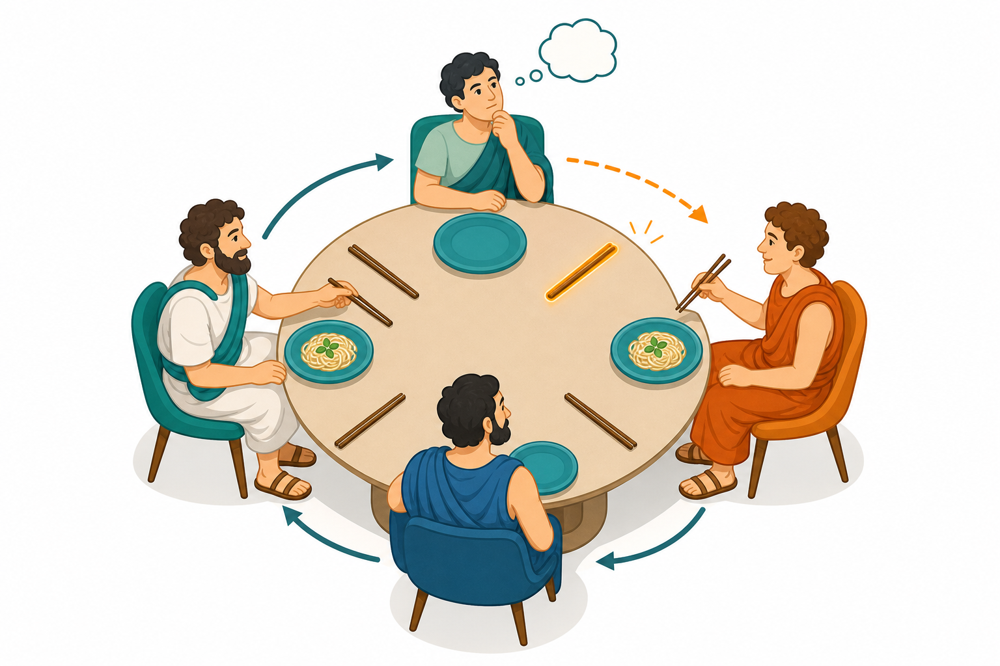

# קיפאון

## הרצאה בקורס מבוא לאימות תוכנה בשיטות פורמליות

הפקולטה למדעי המחשב והמידע | אוניברסיטת בן-גוריון

**גרא וייס**

---

# מטרות ההרצאה

נבין מהו deadlock

- למה מצב סופי הוא טבעי בתוכנית סדרתית אבל לרוב בעייתי במערכת מקבילית.
- מה ההבדל בין עצירה "לגיטימית" לבין עצירה שנובעת מהמתנה הדדית.
- למה קל מאוד להכניס קיפאון גם במודלים שנראים פשוטים.

נראה שתי דוגמאות קלאסיות

- רמזורים מסונכרנים שתוכננו לא נכון.
- בעיית הסועדים של דייקסטרה.
- הרעיון שמאחורי שבירת סימטריה כדי למנוע קיפאון.

המצגת משמשת כהקדמה לפרק התכונות הלינאריות, דרך הדוגמאות הקלאסיות של קיפאון במערכות מקביליות.

---

# מתי מצב סופי הוא בעיה?

תוכנית סדרתית

  

מצב סופי הוא בדרך כלל תוצאה צפויה:

- התוכנית רצה.
- מגיעה למצב בלי מעברים יוצאים.
- והמשמעות היא פשוט: החישוב הסתיים.

$$
\operatorname{Post}(s)=\varnothing
$$

מערכת מקבילית

  

כאן מצב סופי הוא בדרך כלל סימן אזהרה:

- המערכת הגלובלית נתקעה.
- לפחות רכיב אחד עדיין לא "סיים באמת".
- הוא היה יכול להמשיך, אילו רכיב אחר לא היה חוסם אותו.

$$
\text{terminal global state} \;\not\Rightarrow\; \text{successful termination}
$$

<b>אינטואיציה מרכזית:</b> קיפאון מתרחש כאשר המערכת כולה נמצאת במצב סופני,
אף שלפחות רכיב אחד נמצא מקומית במצב לא־סופני. התרחיש הטיפוסי הוא המתנה הדדית בין רכיבים.

---

# דוגמה 1: רמזורים שתוכננו לא נכון

$TrLight_1$

<TransitionSystemD3
  :width="220" :height="180"
  :states="[
    { id: 'r1', text: 'red', initial: true, initialDirection: 'top', x: 110, y: 25, width: 70, color: '#ffebee' },
    { id: 'g1', text: 'green', x: 110, y: 130, width: 78, color: '#e8f5e9' }
  ]"
  :transitions="[
    { source: 'r1', target: 'g1', action: '$\\alpha$', curve: 0.35, actionX: -12 },
    { source: 'g1', target: 'r1', action: '$\\beta$', curve: 0.35, actionX: 12 }
  ]"
/>

$$TrLight_2$$

<TransitionSystemD3
  :width="220" :height="180"
  :states="[
    { id: 'r2', text: 'red', initial: true, initialDirection: 'top', x: 110, y: 25, width: 70, color: '#ffebee' },
    { id: 'g2', text: 'green', x: 110, y: 130, width: 78, color: '#e8f5e9' }
  ]"
  :transitions="[
    { source: 'r2', target: 'g2', action: '$\\beta$', curve: 0.35, actionX: -12 },
    { source: 'g2', target: 'r2', action: '$\\alpha$', curve: 0.35, actionX: 12 }
  ]"
/>

$$TrLight_1 \;\vert\!\vert\!\vert_{\{\alpha,\beta\}}\; TrLight_2$$

<TransitionSystemD3
  :width="260" :height="180"
  :states="[
    { id: 'rr', text: '$\\langle red, red \\rangle$', initial: true, initialDirection: 'top', x: 130, y: 78, width: 120, rx: 10, stroke: '#c62828', strokeWidth: 3, color: '#fff5f5' }
  ]"
  :transitions="[]"
/>

במצב red של הרמזור הראשון, הפעולה האפשרית היא רק $\alpha$.

במצב red של הרמזור השני, הפעולה האפשרית היא רק $\beta$.

לכן ב־$\langle red, red \rangle$ אין פעולה משותפת שניתן לסנכרן עליה, והמערכת נתקעת מיד.

---

# למה זה באמת deadlock?

מה קרה גלובלית?

- המצב ההתחלתי של המערכת המורכבת הוא $\langle red, red \rangle$.
- למצב הזה אין שום מעבר יוצא.
- לכן המערכת הגלובלית היא במצב סופני כבר בצעד הראשון.

למה זה לא "סיום תקין"?

- אף אחד מהרמזורים לא הגיע למצב סופי במובן התכנוני.
- הרמזור הראשון "רוצה" לבצע $\alpha$.
- הרמזור השני "רוצה" לבצע $\beta$.
- כל אחד ממתין לאחר שיספק את הסנכרון שחסר לו.

זו בדיוק רוח ההגדרה: המערכת כולה עצרה, אף שיש רכיבים שבאופן מקומי עדיין אמורים להמשיך.

---

# דוגמה 2: הסועדים של דייקסטרה

ארבעה פילוסופים יושבים סביב שולחן עגול. בין כל שני שכנים יש מקל אכילה אחד בלבד.
כדי לאכול, פילוסוף חייב להחזיק <b>שני</b> מקלות: את השמאלי ואת הימני.

המבנה

- פילוסופים: $P_0,\dots,P_3$
- מקלות: $S_0,\dots,S_3$
- כל החישובים הם מודולו $4$
- לפילוסוף $i$ יש משמאל את $S_i$ ומימין את $S_{i-1}$

תרחיש הסכנה

- כל פילוסוף מרים קודם את המקל השמאלי.
- אחר כך הוא מנסה לקחת את הימני.
- אם כולם עשו זאת יחד, כל אחד מחזיק מקל אחד ומחכה לשני.

מטרת הפרוטוקול

- למנוע deadlock
- לאפשר התקדמות אינסופית של המערכת
- ובפתרון חזק יותר: למנוע גם רעב אישי

כאן, פעולות request ו־release מייצגות סנכרון בין תהליך פילוסוף לתהליך מקל.

---

# תיאור כהרכבה של מערכות מעברים עם סנכרון

התנהגות פילוסוף $Phil_i$

<TransitionSystemD3
  :width="400" :height="260"
  :states="[
    { id: 'think', text: 'think', textFontSize: 12, initial: true, initialDirection: 'top', x: 210, y: 18, width: 88, color: '#e3f2fd' },
    { id: 'waitL', text: 'wait for left stick', textFontSize: 11, x: 110, y: 112, width: 100, height: 52, color: '#fff8e1' },
    { id: 'waitR', text: 'wait for right stick', textFontSize: 11, x: 270, y: 112, width: 100, height: 52, color: '#fff8e1' },
    { id: 'eat',   text: 'eat', textFontSize: 12, x: 210, y: 196, width: 72, color: '#e8f5e9' },
    { id: 'retL', text: 'return the left stick', textFontSize: 10, x: 10, y: 196, width: 100, height: 52, color: '#fff8e1' },
    { id: 'retR', text: 'return the right stick', textFontSize: 10, x: 400, y: 196, width: 100, height: 52, color: '#fff8e1' },
  ]"
  :transitions="[
    { source: 'think', target: 'waitL', action: '$request_{i-1,i}$', curve: 0.18,  actionX:   0, actionY:0 },
    { source: 'think', target: 'waitR', action: '$request_{i,i}$',   curve: -0.18, actionX:   0, actionY:0 },
    { source: 'waitL', target: 'eat',   action: '$request_{i,i}$',   curve: 0.12,  actionX: -10, actionY:-10 },
    { source: 'waitR', target: 'eat',   action: '$request_{i-1,i}$', curve: -0.12, actionX:  10, actionY:-10 },
    { source: 'eat',   target: 'retL',  action: '$release_{i,i}$',   curve: 0,     actionX:  10, actionY:0 },
    { source: 'eat',   target: 'retR',  action: '$release_{i-1,i}$', curve: 0,     actionX: -10, actionY:0 },
    { source: 'retL',  target: 'think', action: '$release_{i-1,i}$', curve: -0.5,  actionX: -10, actionY:0 },
    { source: 'retR',  target: 'think', action: '$release_{i,i}$',   curve: 0.5,   actionX:  10, actionY:0 }
  ]"
/>

התנהגות מקל $Stick_i$

<TransitionSystemD3
  :width="400" :height="100"
  :states="[
    { id: 'avail', text: 'available', textFontSize: 12, initial: true, initialDirection: 'top', x: 180, y: 20, width: 120, color: '#e8f5e9' },
    { id: 'occi', text: 'Occupied by the   right philosopher', textFontSize: 10, x: 295, y: 196, width: 180, color: '#fff8e1' },
    { id: 'occn', text: 'Occupied by the   left philosopher', textFontSize: 10, x: 65,  y: 196, width: 180, color: '#fff8e1' }
  ]"
  :transitions="[
    { source: 'avail', target: 'occi', action: '$request_{i,i}$', curve: 0.2,    actionX: 0 },
    { source: 'avail', target: 'occn', action: '$request_{i,i+1}$', curve: -0.2, actionX: 0 },
    { source: 'occi', target: 'avail', action: '$release_{i,i}$', curve: 0.4,    actionX: 0 },
    { source: 'occn', target: 'avail', action: '$release_{i,i+1}$', curve: -.4,  actionX: 0 }
  ]"
/>

פעולות החשבון הן מודולו-4.
$H =\{request_{i,i+1}, request_{i,i}, release_{i,i+1}, release_{i,i}\ \mid i,j \in \{0,\dots,3\} \}$. 

והמערכת המשולבת מתקבלת מההרכבה:
$TS =  Phil_0  \; \|_H \;  Stick_0 \;\|_H\;  \dots \;\|_H\;  Phil_3   \;\|_H\;  Stick_3$

---

# ריצת קיפאון אופיינית

<DiningPhilosophersDeadlockAnimation :count="4" class="mt-2" />

---

# פתרון באמצעות קביעת פרוטוקול

מקל משופר $Stick_i$

<TransitionSystemD3
  :width="380" :height="270"
  :states="[
    { id: 'ai', text: '$available_{i,i}$', initial: true, initialDirection: 'top', x: 95, y: 30, width: 125, color: '#e8f5e9' },
    { id: 'ai1', text: '$available_{i,i+1}$', x: 285, y: 30, width: 140, color: '#e8f5e9' },
    { id: 'oi', text: '$occupied_i$', x: 95, y: 185, width: 95, color: '#fff8e1' },
    { id: 'oi1', text: '$occupied_{i+1}$', x: 285, y: 185, width: 120, color: '#fff8e1' }
  ]"
  :transitions="[
    { source: 'ai', target: 'oi', action: '$request_{i,i}$' },
    { source: 'oi', target: 'ai1', action: '$release_{i,i}$', actionY: 30, actionX: -40 },
    { source: 'ai1', target: 'oi1', action: '$request_{i,i+1}$' },
    { source: 'oi1', target: 'ai', action: '$release_{i,i+1}$', actionY: 30, actionX: 40 }
  ]"
/>

מה השתנה?

- המקל אינו "נייטרלי" לגמרי, אלא מציין למי הוא זמין כרגע.
- יש שני מצבי זמינות: $available_{i,i}$ ו־$available_{i,i+1}$.
- אחרי שימוש של פילוסוף אחד, הזמינות עוברת לשכן.

איך זה שובר את הקיפאון?

- מאתחלים חלק מהמקלות במצב $available_{i,i}$ וחלק ב־$available_{i,i+1}$.
- למשל: המקלות הראשון והשלישי בכיוון אחד, והשני והרביעי בכיוון ההפוך.
- כך נשברת הסימטריה, ולכן לא ייתכן שכולם ייקחו "באותו כיוון" ויחסמו זה את זה.

אפשר לאמת שהפתרון הזה הוא גם deadlock-free וגם חופשי מרעב אישי.

---

# גרסא עמידה לתקלות

מה רוצים להבטיח?

- שגם אם פילוסוף אחד "נתקע" לנצח במצב think, המערכת לא תיכנס לקיפאון.
- כלומר, שכנים עדיין יוכלו להמשיך להתקדם.

רעיון המודל

- מוסיפים לכל פילוסוף משתנה בוליאני $x_i$.
- $x_i = true$ אם ורק אם פילוסוף $i$ נמצא במצב think.
- מקל $i$ יכול להיות זמין לשכן גם אם "הכיוון הרשמי" כרגע הפוך, כל עוד הפילוסוף האחר רק חושב ואינו זקוק למקל.

כלומר, במקום שהשכנים יחכו עיוור ל"תורם", המידע על מצב החשיבה מאפשר לעקוף חסימה מיותרת.

זאת כבר מערכת ערוצים עם תקשורת סנכרונית באמצעות ערוצים עם קיבולת אפס.

---

# קוד Promela לגרסא עמידה לתקלות

נייצג כל פעולה במערכת המעברים כערוץ סינכרוני בגודל אפס. ב־SPIN הערוץ חייב לשאת שדה הודעה, ולכן נשלח ערך דמה $0$.

<pre><code>#define REQ(p,s) req[(p)*4+(s)]
#define REL(p,s) rel[(p)*4+(s)]

chan req[16] = [0] of { bit };
chan rel[16] = [0] of { bit };
bool x[4];</code></pre>

<pre><code>proctype Phil(byte i) {
  do
  :: x[i] := true;
     skip;                 /* think */
     x[i] := false;

     REQ(i,i)!0;            /* request right stick */
     REQ((i+3)%4,i)!0;      /* request left stick */

     skip;                 /* eat */

     REL(i,i)!0;            /* release right stick */
     REL((i+3)%4,i)!0;      /* release left stick */
  od
}</code></pre>

<pre><code>proctype Stick(byte i) {
  do
  :: REQ(i,i)?0;
     REL(i,i)?0
  :: x[(i+1)%4] == true -&gt;
     REQ(i,(i+1)%4)?0;
     REL(i,(i+1)%4)?0
  od
}

init {
  x[0] = true; x[1] = true; x[2] = true; x[3] = true;

  run Stick(0); run Stick(1); run Stick(2); run Stick(3);
  run Phil(0);  run Phil(1);  run Phil(2);  run Phil(3);
}</code></pre>

הענף השני של Stick(i) הוא החלק העמיד לתקלות: אם הפילוסוף השכן רק חושב, המקל מסונכרן עם הפילוסוף האחר במקום לחסום את המערכת.

---

# אלגוריתם לבדיקת היעדר קיפאון

מה בודקים?

- מריצים סריקה של כל המצבים הנגישים מן המצבים ההתחלתיים.
- בכל מצב $s$ שבודקים, שואלים האם יש לו מעבר יוצא.
- אם נמצא מצב נגיש ללא עוקבים, מצאנו קיפאון.
- אם הסריקה הסתיימה בלי מצב כזה, המערכת היא deadlock-free.

האלגוריתם

1. אתחל מחסנית או תור עם כל המצבים ב־$I$.
2. סמן כל מצב שנשלף כדי לא לבקר בו פעמיים.
3. אם ל־$s$ אין מעבר ב־$\to$, החזר "יש קיפאון".
4. אחרת, הכנס את כל העוקבים של $s$ שעדיין לא בוקרו.
5. אם התור התרוקן, החזר "אין קיפאון נגיש".

זהו בדיוק חיפוש נגישות רגיל על גרף המצבים.  
העלות היא לינארית בגודל המודל המפורש:

$$
O(|S| + |\to|)
$$

---

# סיכום

מה לקחת מכאן?

- במערכות מקביליות, מצב סופני הוא בדרך כלל חשוד.
- קיפאון נובע לעיתים קרובות מהמתנה הדדית.
- קל מאוד לייצר אותו כאשר רכיבים סימטריים מתחרים על משאבים.

ומה עוזר?

- שבירת סימטריה.
- שליטה מפורשת בזמינות משאבים.
- ולעיתים גם חשיפת מידע מקומי נוסף, כמו המשתנה $x_i$.

כאן קיבלנו את האינטואיציה. בהמשך הפרק עוברים להגדרה פורמלית של מסלולים,
עקבות ותכונות זמן לינאריות.

כיוון שבמערכות עם קיפאון יש ריצות באורך סופי, ויהיה לנו פשוט יותר לנתח מערכות שכל הריצות שלהן אינסופיות, נניח שאין במערכות שלנו קיפאון וגם שאין מצבים סופניים.

