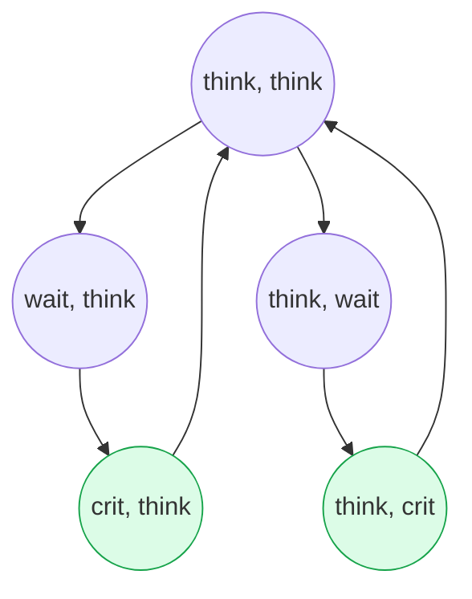

# תכונות שמורה

## הרצאה בקורס מבוא לאימות תוכנה בשיטות פורמליות

הפקולטה למדעי המחשב והמידע | אוניברסיטת בן-גוריון

**גרא וייס**

---

# מהי שמורה?

חלק גדול מהתכונות שאנחנו רוצים לאמת במערכות מקביליות מתארות מצבים ש**אסור** שיתקיימו. 
תכונות אלו נקראות לעיתים קרובות תכונות בטיחות (Safety Properties), שהאינטואיציה מאחוריהן היא ש"שום דבר רע לעולם לא יקרה".

הסוג הפשוט והנפוץ ביותר של תכונות בטיחות הוא **שמורות (Invariants)**.

הרעיון המרכזי:

שמורה היא תנאי על מצב המערכת, שצריך להיות תמיד נכון. היא תלויה אך ורק ב**מצב הנוכחי** של המערכת, ולא בהיסטוריה שלה או בסדר הפעולות.

---

# הגדרה פורמלית

כדי להגדיר שמורה באופן פורמלי בתור תכונת זמן לינארי (קבוצה של עקבות), נשתמש בלוגיקה פסוקית (Propositional Logic).

הגדרה 3.20 (Baier & Katoen)

תהי $\Phi$ נוסחה בלוגיקה פסוקית מעל קבוצת הפרופוזיציות האטומיות $AP$.
תכונת זמן לינארי $P_{inv}$ נקראת **שמורה** אם:
$$P_{inv} = \left\{ A_0 A_1 A_2 \dots \in (2^{AP})^\omega \;\middle|\; \forall j \ge 0. A_j \models \Phi \right\}$$

הנוסחה $\Phi$ נקראת **תנאי השמורה** (Invariant Condition).

לכן, מערכת מקיימת שמורה ($TS \models P_{inv}$) אם ורק אם התנאי $\Phi$ מתקיים ב**כל המצבים הנגישים** במערכת:
$$ \forall s \in \operatorname{Reach}(TS). L(s) \models \Phi $$

---

# דוגמאות לשמורות

### מניעה הדדית (Mutual Exclusion)
התכונה "תמיד לכל היותר תהליך אחד נמצא בקטע הקריטי".
התנאי הלוגי:
$$ \Phi = \neg crit_1 \lor \neg crit_2 $$

### חסינות לקיפאון (Deadlock Freedom) בדוגמת הפילוסופים
לפילוסופים הסועדים, קיפאון מתרחש כאשר כולם מחכים למקל השני (נמצאים במצב $wait$). 
תנאי השמורה לחסינות מקיפאון יבטיח שלפחות פילוסוף אחד *לא* ממתין:
$$ \Phi = \neg wait_0 \lor \neg wait_1 \lor \dots \lor \neg wait_4 $$

---

# איך בודקים אם שמורה מתקיימת?

מכיוון ששמורה היא תנאי על מצבים, הבדיקה שלה שקולה ל**בדיקת נגישות** (Reachability Analysis) בגרף המצבים של המערכת.

אלגוריתם בסיסי: סריקת מצבים

1. התחל מקבוצת המצבים ההתחלתיים $I$.
2. בצע סריקת עומק (DFS) או סריקת רוחב (BFS) על גרף המצבים.
3. עבור כל מצב $s$ שנצפה, בדוק האם $L(s) \models \Phi$.
4. אם כן - המשך. אם לא - השמורה **הופרה**.
5. אם הסריקה הסתיימה וכל המצבים הנגישים תקינים - השמורה **מתקיימת**.

זוהי סריקה *קדימה* (Forward Search). ניתן לבצע גם סריקה *אחורה* (Backward Search): להתחיל מהמצבים שבהם $\Phi$ אינו מתקיים, ולבדוק האם קיים מסלול הפוך המגיע למצב התחלתי.

---

# מציאת דוגמה נגדית (Counterexample)

אם מצאנו מצב שבו השמורה מופרת, פשוט להחזיר "שקר" אינו מועיל מספיק. אנחנו רוצים להבין **למה** השמורה מופרת.

דוגמה נגדית עבור שמורה היא **מסלול סופי** במערכת:
$$ s_0 \to s_1 \to s_2 \to \dots \to s_n $$
כך ש:
1. $s_0 \in I$ (מצב התחלתי)
2. לכל $0 \le i < n$ מתקיים $L(s_i) \models \Phi$
3. $L(s_n) \not\models \Phi$ (במצב האחרון השמורה מופרת)

הפקת הדוגמה הנגדית ב-DFS:

כאשר משתמשים בחיפוש לעומק (DFS), תכולת המחסנית ברגע גילוי המצב הבעייתי $s_n$ מהווה בדיוק את המסלול מהמצב ההתחלתי אל אותו מצב (בסדר הפוך).

---

# סיבוכיות זמן לבדיקת שמורות

מהי העלות החישובית של וידוא שמורות?

משפט 3.21 (סיבוכיות זמן)

סיבוכיות הזמן של אלגוריתם בדיקת שמורות מבוסס DFS היא:
$$ O\bigl( N \cdot (1 + |\Phi|) + M \bigr) $$

כאשר:
- **$N$**: מספר המצבים הנגישים (Reachable states) במערכת.
- **$M$**: מספר המעברים (Transitions) בין המצבים הנגישים.
- **$|\Phi|$**: אורך הנוסחה הפסוקית $\Phi$ (מספר הפעולות). הבדיקה האם מצב מקיים את $\Phi$ לוקחת זמן $O(1 + |\Phi|)$.

לסיכום, הבדיקה היא **לינארית** בגודל החלק הנגיש של מודל המערכת.

---

# סיכום

שמורות (Invariants)

- התכונות הלינאריות הפשוטות והנפוצות ביותר.
- מגדירות תנאי פסוקי שחייב להתקיים ב**כל מצב** נגיש במערכת.
- תלויות רק במצב הנוכחי, ולא בעבר או בעתיד.
- משמשות להוכחת מניעה הדדית, היעדר קיפאון, ותכונות בטיחות בסיסיות נוספות.

אלגוריתמיקה

- וידוא שמורות שקול לפתרון בעיית נגישות (Reachability) בגרף.
- ניתן לבצע ביעילות (זמן לינארי בגודל המרחב הנגיש) באמצעות DFS או BFS.
- מספק מיד דוגמה נגדית (Counterexample) המציגה את מסלול השגיאה.
- בהרצאה הבאה: תכונות בטיחות שאינן בהכרח שמורות.

