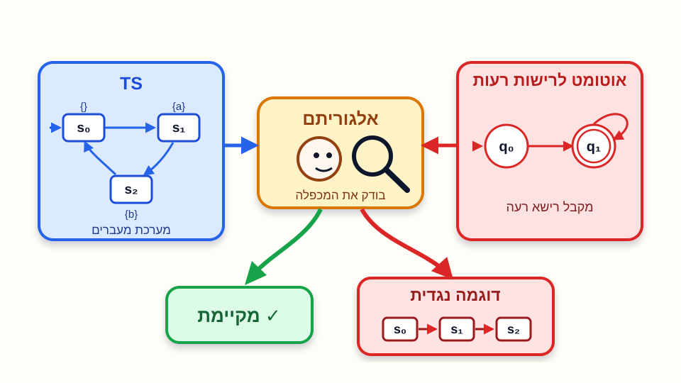

# בדיקת תכונות בטיחות רגולריות

הרצאה בקורס מבוא לאימות תוכנה בשיטות פורמליות

הפקולטה למדעי המחשב והמידע | אוניברסיטת בן-גוריון

**גרא וייס**

---

# מטרות ההרצאה

נחזור לתכונות בטיחות רגולריות

- נגדיר תכונת בטיחות רגולרית דרך רישות רעות.
- נראה למה מספיק להסתכל על רישות רעות מינימליות.
- נבדיל בין תכונות בטיחות רגולריות ולא רגולריות.

נבנה אלגוריתם בדיקה

- נתרגם בדיקת תכונת בטיחות רגולרית לבדיקת שְׁמוּרָה.
- נבנה מכפלה של מערכת מעברים עם אוטומט סופי.
- נשתמש בהפרת הַשְׁמוּרָה כדי להפיק דוגמה נגדית סופית.

---

# תזכורת: רישות רעות

תכונת בטיחות <KatexInline math="P_{\mathrm{safe}}" /> היא תכונה שבה כל הפרה נחשפת אחרי מספר סופי של צעדים.

<KatexInline display math="\begin{array}{rcl}
\mathit{BadPref}(P_{\mathrm{safe}}) &amp;=&amp; \{\rho\in(2^{AP})^* \mid \forall\sigma\in(2^{AP})^\omega\ (\rho\sigma\notin P_{\mathrm{safe}})\}\\[4pt]
&amp;=&amp; (2^{AP})^* \setminus \mathit{pref}(P_{\mathrm{safe}})
\end{array}" />

רישא רעה

מרגע שראינו אותה, שום המשך אינסופי כבר לא יכול לתקן את ההפרה.

דוגמה נגדית סופית

לכן בדיקת בטיחות מחזירה עדות סופית: מסלול שמגיע לרישא רעה.

---

# תכונת בטיחות רגולרית

תכונת בטיחות <KatexInline math="P_{\mathrm{safe}}" /> היא רגולרית אם קבוצת הרישות הרעות שלה היא שפה רגולרית:

קבוצת הרישות הרעות
<KatexInline math="\mathit{BadPref}(P_{\mathrm{safe}})\subseteq (2^{AP})^*" />
היא שפה רגולרית.

קיים אוטומט סופי <KatexInline math="\mathcal{A}" /> מעל האלפבית <KatexInline math="2^{AP}" /> כך ש־
<KatexInline math="\mathcal{L}(\mathcal{A})=\mathit{BadPref}(P_{\mathrm{safe}})" />.

---

# רישות רעות מינימליות

רישא רעה <KatexInline math="\rho" /> היא מינימלית אם אף רישא ממש שלה אינה רעה.

<KatexInline display math="\mathit{MinBadPref}(P_{\mathrm{safe}})=\{\rho\in\mathit{BadPref}(P_{\mathrm{safe}})\mid \forall\rho'\prec\rho\ \left(\rho'\notin\mathit{BadPref}(P_{\mathrm{safe}})\right)\}" />

למה זה שימושי?

אוטומט עבור רישות מינימליות עוצר בדיוק בנקודת ההפרה הראשונה, ולכן הדוגמה הנגדית שהוא מייצר בדרך כלל קצרה וברורה יותר.

משפט

<KatexInline math="P_{\mathrm{safe}}" /> רגולרית אם ורק אם
<KatexInline math="\mathit{MinBadPref}(P_{\mathrm{safe}})" /> רגולרית.

נסו להוכיח בעצמכם 💪

---

# למה המינימליות שומרת רגולריות?

ממינימליות לכל הרישות הרעות

אם יש אוטומט שמקבל את הרישות הרעות המינימליות, מוסיפים לכל מצב מקבל לולאות על כל אות באלפבית.
מרגע שהגענו להפרה, כל המשך נשאר רישא רעה.

<AutomatonD3 variant="classic" :width="360" :height="170" :arrowSize="4" :stateLabelFontSize="14" :transitionLabelFontSize="13"
  :states="[
    { id: 'q0', x: 90, y: 85, label: '$q_0$', initial: true, initialDirection: 'top', r: 20, labelWidth: 60 },
    { id: 'qf', x: 245, y: 85, label: '$q_f$', accepting: true, r: 20, labelWidth: 60 }
  ]"
  :transitions="[
    { source: 'q0', target: 'qf', label: '$u$', labelY: -10, labelWidth: 45 },
    { source: 'qf', target: 'qf', label: '$\\Sigma$', loopDirection: '0deg', labelX: 24, labelWidth: 55 }
  ]"
/>

מכל הרישות הרעות למינימליות

אם יש אוטומט שמקבל את כל הרישות הרעות, מסירים את כל המעברים היוצאים ממצבים מקבלים.
כך מתקבלות רק מילים שבהן הקבלה מתרחשת לראשונה בסוף המילה.

<AutomatonD3 variant="classic" :width="360" :height="170" :arrowSize="4" :stateLabelFontSize="14" :transitionLabelFontSize="13"
  :states="[
    { id: 'q0', x: 90, y: 85, label: '$q_0$', initial: true, initialDirection: 'top', r: 20, labelWidth: 60 },
    { id: 'qf', x: 245, y: 85, label: '$q_f$', accepting: true, r: 20, labelWidth: 60 }
  ]"
  :transitions="[
    { source: 'q0', target: 'qf', label: '$u$', labelY: -10, labelWidth: 45 }
  ]"
/>

האינטואיציה: רישא רעה היא “נקודת אַל־חזור”; רישא רעה מינימלית היא נקודת אַל־חזור הראשונה.

---

# הבעיה האלגוריתמית

קלט

מערכת מעברים סופית <KatexInline math="TS" />, ואוטומט סופי <KatexInline math="\mathcal{A}" /> עבור הרישות הרעות של תכונת בטיחות רגולרית <KatexInline math="P_{\mathrm{safe}}" />:

<KatexInline math="\mathcal{L}(\mathcal{A})=\mathit{BadPref}(P_{\mathrm{safe}})" />

פלט רצוי

אלגוריתם שמכריע אם <KatexInline math="TS\models P_{\mathrm{safe}}" />.
אם לא, הוא מפיק דוגמה נגדית סופית: מסלול של <KatexInline math="TS" /> שהעקבה שלו מגיעה לרישא רעה.

פלט: ריצה סופית <KatexInline math="s_0s_1\cdots s_n" /> כך ש־
<KatexInline math="L(s_0)L(s_1)\cdots L(s_n)\in\mathit{BadPref}(P_{\mathrm{safe}})" />,
 
או הודעה שלא קיימת ריצה כזאת.

---

# דוגמאות

שְׁמוּרָה

כל שְׁמוּרָה היא תכונת בטיחות רגולרית.

<KatexInline math="\mathit{MinBadPref} = (2^{AP})^* \neg\Phi" />

ראינו אלגוריתמים לבדיקת תכונות שְׁמוּרָה

תכונת בטיחות רגולרית שאינה שְׁמוּרָה

אור אדום נדלק רק אם בצעד הקודם דלק אור צהוב.
צריך לזכור צעד אחד אחורה.

אין לנו עדיין אלגוריתם לתכונות שאינן שְׁמוּרָה

בטיחות לא רגולרית

בכל רישא סופית, מספר המטבעות שהוכנסו אינו קטן ממספר המשקאות שסופקו.
כאן צריך זיכרון לא חסום.

לא נתאר אלגוריתם לתכונות שאינן רגולריות

---

# דוגמה: מניעה הדדית

בתכונת מניעה הדדית דורשים ששני תהליכים לא יהיו באזור הקריטי בו־זמנית.

<KatexInline display math="P_{\mathrm{mutex}}=\{\sigma\mid \forall i\ge 0\ (\sigma[i]\not\models (crit_1\land crit_2))\}" />

רישא רעה מינימלית

מסלול שמסתיים בפעם הראשונה במצב שבו <KatexInline math="crit_1\land crit_2" /> נכון.

אוטומט הבדיקה

מספיק אוטומט קטן: כל עוד לא ראינו הפרה נשארים במצב תקין; כשנראה <KatexInline math="crit_1\land crit_2" /> עוברים למצב מקבל.

---

# דוגמה: רמזור

נדרוש שאור אדום לא יידלק אם לא דלק אור צהוב בדיוק בצעד הקודם.

<AutomatonD3 variant="classic" :width="760" :height="235" :arrowSize="4.5" :stateLabelFontSize="16" :transitionLabelFontSize="14"
  :states="[
    { id: 's1', x: 135, y: 130, label: '$s_1$', r: 22, labelWidth: 70 },
    { id: 's0', x: 380, y: 130, label: '$s_0$', initial: true, initialDirection: 'top', r: 22, labelWidth: 70 },
    { id: 's2', x: 610, y: 130, label: '$s_2$', r: 22, accepting: true, labelWidth: 70 }
  ]"
  :transitions="[
    { source: 's0', target: 's1', label: '$yellow \\land \\neg red$', curve: 0.36, labelY: -12, labelWidth: 145, tooltip: 'האותיות המקיימות: {yellow}' },
    { source: 's1', target: 's0', label: '$\\neg yellow$', curve: 0.30, labelY: 12, labelWidth: 105, tooltip: 'האותיות המקיימות: ∅, {red}' },
    { source: 's1', target: 's1', label: '$yellow$', loopDirection: '180deg', labelX: -32, labelY: 0, labelWidth: 85, tooltip: 'האותיות המקיימות: {yellow}, {red, yellow}' },
    { source: 's0', target: 's0', label: '$\\neg(yellow \\lor red)$', loopDirection: '90deg',  labelY: 10, labelWidth: 145, tooltip: 'האותיות המקיימות: ∅' },
    { source: 's0', target: 's2', label: '$red$', labelY: -10, labelWidth: 70, tooltip: 'האותיות המקיימות: {red}, {red, yellow}' },
    { source: 's2', target: 's2', label: '$True$', loopDirection: '0deg', labelX: 32, labelY: 0, labelWidth: 70, tooltip: 'כל האותיות' }
  ]"
/>

האוטומט זוכר אם בצעד הקודם דלק צהוב; אם אדום מופיע בלי זיכרון כזה, עוברים למצב מקבל.

---

# רעיון האלגוריתם : רדוקציה לבדיקת שְׁמוּרָה

נוסיף למערכת רכיב שיזהה שנצפתה
רישא רעה

ונבדוק את תכונת הַשְׁמוּרָה
 
“אף פעם לא נצפית רישא רעה”

<svg class="absolute left-[450px] top-[126px] w-[315px] h-[92px] z-20 overflow-visible" viewBox="-8 -12 325 92" fill="none" xmlns="http://www.w3.org/2000/svg">
  <defs>
    <marker id="monitor-arrow-head" markerWidth="8" markerHeight="8" refX="7" refY="4" orient="auto" markerUnits="strokeWidth">
      <path d="M 0 0 L 8 4 L 0 8 z" fill="#1d4ed8" />
    </marker>
  </defs>
  <path d="M 0 42 C 78 42, 122 42, 138 24 S 210 18, 281 18" stroke="#1d4ed8" stroke-width="7" stroke-linecap="round" marker-end="url(#monitor-arrow-head)" />
</svg>

---

# דוגמה לצורך המחשת רעיון הרדוקציה: מונה פשוט

נבדוק את התכונה: בכל שלושה צעדים רצופים, לפחות אחד מקיים <KatexInline math="\psi" />.

<KatexInline display math="P=\{\sigma\mid \forall i\ (\sigma[i]\models\psi\ \lor\ \sigma[i+1]\models\psi\ \lor\ \sigma[i+2]\models\psi)\}" />

המערכת המקורית

בכל צעד עוברת ממצב <KatexInline math="s" /> למצב <KatexInline math="t" /> ומייצרת תווית <KatexInline math="L(t)" />.

+

מנגנון התראה

שומר מונה <KatexInline math="c\in\{0,1,2,3\}" /> של מספר הצעדים הרצופים שבהם לא התקיים <KatexInline math="\psi" />.

מונה 0

ראינו <KatexInline math="\psi" />

מונה 1

צעד אחד בלי <KatexInline math="\psi" />

מונה 2

שני צעדים בלי <KatexInline math="\psi" />

התראה

שלושה צעדים בלי <KatexInline math="\psi" />

במערכת המורחבת המצבים הם מהצורה <KatexInline math="\langle s,c\rangle" />.
אם <KatexInline math="L(t)\models\psi" /> מאפסים את המונה; אחרת מעלים אותו באחד. כאשר מגיעים ל־<KatexInline math="c=3" />, התווית של המצב כוללת <KatexInline math="bad" />.

---

# הרכבת המונה עם המערכת

נבנה מערכת מעברים חדשה כמכפלה סינכרונית של המערכת המקורית עם מונה דטרמיניסטי, כך שהמונה זוכר כמה צעדים רצופים עברו בלי <KatexInline math="\psi" />.

<KatexInline display math="TS_{\#}=\langle S\times\{0,1,2,3\},Act,\to_{\#},I_{\#},AP\cup\{bad\},L_{\#}\rangle" />

מצבים התחלתיים

מתחילים באותו מצב מערכת, והמונה נקבע לפי התווית הראשונה:

<KatexInline math="I_{\#}=\{\langle s,0\rangle\mid s\in I,\ L(s)\models\psi\}\cup\{\langle s,1\rangle\mid s\in I,\ L(s)\not\models\psi\}" />

כלל גזירה: עדכון המונה והמעבר במכפלה

המעברים במערכת <KatexInline math="TS_{\#}" /> מוגדרים על ידי הכלל:

<KatexInline display math="\frac{s\xrightarrow{\alpha}t,\quad c'=\begin{cases}0 & L(t)\models\psi\\ \min(c+1,3) & L(t)\not\models\psi\end{cases}}{\langle s,c\rangle\xrightarrow{\alpha}_{\#}\langle t,c'\rangle}" />

בדיקת שְׁמוּרָה על המערכת החדשה

על המערכת שקיבלנו נוכל לבדוק את תכונת הַשְׁמוּרָה:

<KatexInline math="P_{inv}=\{\sigma\mid \forall i\ge 0\ (\sigma[i]\models\neg bad)\}" />

<KatexInline math="TS\models P\iff TS_{\#}\models P_{inv}" />

תוויות

התווית המקורית נשמרת, ונוסיף התראה אם ראינו שלושה צעדים רצופים בלי <KatexInline math="\psi" />:

<KatexInline math="L_{\#}(\langle s,c\rangle)=L(s)\cup\begin{cases}\{bad\} & c=3\\ \emptyset & c\neq 3\end{cases}" />

# ניסוח הבעיה

נתונים:

מערכת מעברים סופית ללא מצבים סופניים:

<KatexInline math="TS=\langle S,Act,\to,I,AP,L\rangle" />

אוטומט סופי מעל <KatexInline math="2^{AP}" /> שמקבל את הרישות הרעות:

<KatexInline math="\mathcal{L}(\mathcal{A})=\mathit{BadPref}(P_{\mathrm{safe}})" />

המטרה: להכריע האם <KatexInline math="TS\models P_{\mathrm{safe}}" />.

---

# נפעיל את אותו הרעיון  לבדיקת תכונות בטיחות רגולרית באופן כללי

נריץ את המערכת ואת אוטומט הרישות הרעות במקביל.

מערכת המעברים מייצרת עקבה:

<KatexInline math="L(s_0)L(s_1)L(s_2)\cdots" />

+

האוטומט קורא את התוויות ומזהה מתי נוצרה רישא רעה.

אם מגיעים למצב מקבל של האוטומט, מצאנו רישא רעה ולכן מצאנו הפרה של תכונת הבטיחות.

---

# המכפלה עם אוטומט הרישות הרעות

נשתמש באוטומט סופי:

<KatexInline display math="\mathcal{A}=\langle Q,2^{AP},\delta,Q_0,F\rangle" />

נבנה מערכת מעברים חדשה שבה כל מצב שומר שני רכיבים:

<KatexInline display math="TS\times\mathcal{A}=\langle S\times Q,Act,\to_\times,I_\times,Q,L_\times\rangle" />

הרכיב הראשון הוא מצב המערכת; הרכיב השני הוא מצב האוטומט אחרי קריאת התוויות שראינו עד כה.

---

# הגדרת המכפלה

המצבים ההתחלתיים:

<KatexInline display math="I_\times=\{\langle s_0,q\rangle \mid s_0\in I \land \exists q_0\in Q_0\ (q\in\delta(q_0,L(s_0)))\}" />

המעברים:

<KatexInline display math="\frac{s\xrightarrow{\alpha}t \ \land\ p\in\delta(q,L(t))}{\langle s,q\rangle\xrightarrow{\alpha}_\times \langle t,p\rangle}" />

התווית במכפלה משקפת את מצב האוטומט:

<KatexInline display math="L_\times(\langle s,q\rangle)=\{q\}" />

---

# מה המכפלה מייצגת?

מסלול סופי במכפלה:

<KatexInline display math="\langle s_0,q_1\rangle\langle s_1,q_2\rangle\cdots\langle s_n,q_{n+1}\rangle" />

קיים אם ורק אם <KatexInline math="s_0s_1\cdots s_n" /> הוא מסלול סופי התחלתי של <KatexInline math="TS" />, וקיימת ריצה של האוטומט:

<KatexInline display math="q_0 \xrightarrow{L(s_0)} q_1 \xrightarrow{L(s_1)} q_2 \cdots \xrightarrow{L(s_n)} q_{n+1}" />

לכן מצב מקבל במכפלה פירושו: העקבה הסופית שנוצרה עד כה שייכת לשפת הרישות הרעות.

---

# הַשְׁמוּרָה שמחליפה את הבטיחות

במכפלה כבר אין צורך לדבר על כל השפה הרגולרית. מספיק לבדוק שאף פעם לא מגיעים למצב אוטומט מקבל.

<KatexInline display math="P_{\mathrm{inv}}=\{\sigma\in(2^Q)^\omega \mid \forall i\ge 0\ (\sigma[i]\cap F=\emptyset)\}" />

אם הַשְׁמוּרָה מתקיימת, אין רישא רעה באף עקבה של המערכת.

אם הַשְׁמוּרָה מופרת, המסלול שמגיע ל־<KatexInline math="F" /> הוא דוגמה נגדית סופית.

---

# אינטואיציית הבניה

  

    
  

  

    <KatexInline math="TS\times\mathcal{A}" />
  

  

    האוטומט עוקב אחר העקבות שנוצרות
  

  

    מערכת המעברים מייצרת עקבות
  

  <svg class="absolute left-[184px] top-[42px] w-[212px] h-[148px]" viewBox="0 0 212 148" fill="none" xmlns="http://www.w3.org/2000/svg">
    <defs>
      <marker id="arrow-red-build" markerWidth="8" markerHeight="8" refX="7" refY="4" orient="auto" markerUnits="strokeWidth">
        <path d="M 0 0 L 8 4 L 0 8 z" fill="#dc2626" />
      </marker>
    </defs>
    <path d="M 48 124 C 62 86, 98 58, 156 44" stroke="#dc2626" stroke-width="6" stroke-linecap="round" marker-end="url(#arrow-red-build)" />
  </svg>

  <svg class="absolute right-[176px] top-[26px] w-[204px] h-[148px]" viewBox="0 0 204 148" fill="none" xmlns="http://www.w3.org/2000/svg">
    <defs>
      <marker id="arrow-blue-build" markerWidth="8" markerHeight="8" refX="7" refY="4" orient="auto" markerUnits="strokeWidth">
        <path d="M 0 0 L 8 4 L 0 8 z" fill="#1d4ed8" />
      </marker>
    </defs>
    <path d="M 170 34 C 150 64, 122 94, 70 126" stroke="#1d4ed8" stroke-width="6" stroke-linecap="round" marker-end="url(#arrow-blue-build)" />
  </svg>

  

    <KatexInline display math="\frac{s\xrightarrow{\alpha}{\color{blue}t}\ \land\ p\in\delta(q,L({\color{blue}t}))}{\langle s,q\rangle\xrightarrow{\alpha}_{\times}\langle {\color{blue}t},p\rangle}" />
  

  

    קיים מעבר מערכת המעברים המקורית
  

  

    קיים מעבר באוטומט הקורא את התווית של t
  

  

    מערכת המעברים החדשה מתקדמת בשני הרכיבים, זה שמייצג את מערכת המעברים המקורית וזה שעוקב אחר האוטומט
  

---

# דוגמה: מערכת בת 3 מצבים

מערכת המעברים <KatexInline math="TS" />

<TransitionSystemD3
:width="440" :height="95" :auto="false"
:states="[
{ id: 't0', text: '$0$', label: '$\\{\\}$', initial: true, initialDirection: 'left', x: 60, y: 48, width: 44 },
{ id: 't1', text: '$1$', label: '$\\{\\}$', x: 190, y: 48, width: 44 },
{ id: 't2', text: '$2$', label: '$\\{X\\}$', x: 320, y: 48, width: 44 }
]"
:transitions="[
{ source: 't0', target: 't1', action: '$tick$', actionY: -10, actionWidth: 40 },
{ source: 't1', target: 't2', action: '$tick$', actionY: -10, actionWidth: 40 },
{ source: 't2', target: 't0', action: '$tick$', curve: 0.25, actionY: -14, actionWidth: 40 }
]"
/>

אוטומט הרישות הרעות <KatexInline math="\mathcal{A}" />

<AutomatonD3 variant="classic" :width="440" :height="120" :arrowSize="3.5" :stateLabelFontSize="10" :transitionLabelFontSize="10"
:states="[
{ id: 'q0', x: 70, y: 58, label: '$q_0$', initial: true, initialDirection: 'top', r: 18 },
{ id: 'q1', x: 165, y: 58, label: '$q_1$',                  r: 18 },
{ id: 'q2', x: 260, y: 58, label: '$q_2$',                  r: 18 },
{ id: 'q3', x: 355, y: 58, label: '$q_3$', accepting: true, r: 18}
]"
:transitions="[
{ source: 'q0', target: 'q1', label: '$\\{\\}$', labelY: -10 },
{ source: 'q1', target: 'q2', label: '$\\{\\}$', labelY: -10 },
{ source: 'q2', target: 'q3', label: '$\\{\\}$', labelY: -10 },
{ source: 'q3', target: 'q3', label: '$\\{\\}$', loopDirection: '0deg', labelX: 20, loopRadius: 48 },
{ source: 'q0', target: 'q0', label: '$\\{X\\}$',    loopDirection: '180deg', labelX: -18, loopRadius: 48 },
{ source: 'q1', target: 'q0', label: '$\\{X\\}$', curve: -0.30, labelY: 15 },
{ source: 'q2', target: 'q0', label: '$\\{X\\}$', curve: 0.30, labelY: -10 },
{ source: 'q3', target: 'q1', label: '$\\{X\\}$', curve: -0.22, labelY: 15 }
]"
/>

<KatexInline math="TS \times \mathcal{A}" />

<TransitionSystemD3
:width="340" :height="190" :auto="false"
:states="[
{ id: 'p0', text: '$\\langle 0, q_1 \\rangle$', label: '$\\{\\}$', labelY: 12, initial: true, initialDirection: 'top', x: 170, y: 45, width: 80, color: '#DCFCE7', stroke: '#15803D' },
{ id: 'p1', text: '$\\langle 1, q_2 \\rangle$', label: '$\\{\\}$', labelY: 12, x: 255, y: 140, width: 80, color: '#DCFCE7', stroke: '#15803D' },
{ id: 'p2', text: '$\\langle 2, q_0 \\rangle$', label: '$\\{X\\}$', labelY: 12, x: 85, y: 140, width: 80, color: '#DCFCE7', stroke: '#15803D' }
]"
:transitions="[
{ source: 'p0', target: 'p1', action: '$tick$', actionX: 10, actionY: -5 },
{ source: 'p1', target: 'p2', action: '$tick$', actionY: 12 },
{ source: 'p2', target: 'p0', action: '$tick$', actionX: -10, actionY: -5 }
]"
/>

התוצאה: התכונה מתקיימת!

אף מצב נגיש במערכת המכפלה אינו מכיל את המצב המקבל <KatexInline math="q_3" />, לכן <KatexInline math="TS \models P_{\text{safe}}" />.

---

# דוגמה: מערכת בת 4 מצבים

מערכת המעברים <KatexInline math="TS" />

<TransitionSystemD3
:width="440" :height="95" :auto="false"
:states="[
{ id: 't0', text: '$0$', label: '$\\{\\}$', initial: true, initialDirection: 'left', x: 70, y: 48, width: 44 },
{ id: 't1', text: '$1$', label: '$\\{\\}$', x: 165, y: 48, width: 44 },
{ id: 't2', text: '$2$', label: '$\\{\\}$', x: 260, y: 48, width: 44 },
{ id: 't3', text: '$3$', label: '$\\{X\\}$', x: 355, y: 48, width: 44 }
]"
:transitions="[
{ source: 't0', target: 't1', action: '$tick$', actionY: -10, actionWidth: 40 },
{ source: 't1', target: 't2', action: '$tick$', actionY: -10, actionWidth: 40 },
{ source: 't2', target: 't3', action: '$tick$', actionY: -10, actionWidth: 40 },
{ source: 't3', target: 't0', action: '$tick$', curve: 0.25, actionY: -14, actionWidth: 40 }
]"
/>

אוטומט הרישות הרעות <KatexInline math="\mathcal{A}" />

<AutomatonD3 variant="classic" :width="440" :height="120" :arrowSize="3.5" :stateLabelFontSize="10" :transitionLabelFontSize="10"
:states="[
{ id: 'q0', x: 70, y: 58, label: '$q_0$', initial: true, initialDirection: 'top', r: 18 },
{ id: 'q1', x: 165, y: 58, label: '$q_1$',                  r: 18 },
{ id: 'q2', x: 260, y: 58, label: '$q_2$',                  r: 18 },
{ id: 'q3', x: 355, y: 58, label: '$q_3$', accepting: true, r: 18}
]"
:transitions="[
{ source: 'q0', target: 'q1', label: '$\\{\\}$', labelY: -10 },
{ source: 'q1', target: 'q2', label: '$\\{\\}$', labelY: -10 },
{ source: 'q2', target: 'q3', label: '$\\{\\}$', labelY: -10 },
{ source: 'q3', target: 'q3', label: '$\\{\\}$', loopDirection: '0deg', labelX: 20, loopRadius: 48 },
{ source: 'q0', target: 'q0', label: '$\\{X\\}$',    loopDirection: '180deg', labelX: -18, loopRadius: 48 },
{ source: 'q1', target: 'q0', label: '$\\{X\\}$', curve: -0.30, labelY: 15 },
{ source: 'q2', target: 'q0', label: '$\\{X\\}$', curve: 0.30, labelY: -10 },
{ source: 'q3', target: 'q1', label: '$\\{X\\}$', curve: -0.22, labelY: 15 }
]"
/>

<KatexInline math="TS \times \mathcal{A}" />

<TransitionSystemD3
:width="340" :height="190" :auto="false"
:states="[
{ id: 'p0', text: '$\\langle 0, q_1 \\rangle$', label: '$\\{\\}$', labelY: 12, initial: true, initialDirection: 'top', x: 55, y: 45, width: 80, color: '#DCFCE7', stroke: '#15803D' },
{ id: 'p1', text: '$\\langle 1, q_2 \\rangle$', label: '$\\{\\}$', labelY: 12, x: 55, y: 140, width: 80, color: '#DCFCE7', stroke: '#15803D' },
{ id: 'p2', text: '$\\langle 2, q_3 \\rangle$', label: '$\\{\\}$', labelY: 12, x: 170, y: 140, width: 80, color: '#FEE2E2', stroke: '#991B1B' },
{ id: 'p3', text: '$\\langle 3, q_3 \\rangle$', label: '$\\{X\\}$', labelY: 12, x: 285, y: 140, width: 80, color: '#FEE2E2', stroke: '#991B1B' },
{ id: 'p4', text: '$\\langle 0, q_3 \\rangle$', label: '$\\{\\}$', labelY: 12, x: 285, y: 45, width: 80, color: '#FEE2E2', stroke: '#991B1B' },
{ id: 'p5', text: '$\\langle 1, q_3 \\rangle$', label: '$\\{\\}$', labelY: 12, x: 170, y: 45, width: 80, color: '#FEE2E2', stroke: '#991B1B' }
]"
:transitions="[
{ source: 'p0', target: 'p1', action: '$tick$', actionX: -18 },
{ source: 'p1', target: 'p2', action: '$tick$', actionY: 10 },
{ source: 'p2', target: 'p3', action: '$tick$', actionY: 10 },
{ source: 'p3', target: 'p4', action: '$tick$', actionX: 18 },
{ source: 'p4', target: 'p5', action: '$tick$', actionY: -10 },
{ source: 'p5', target: 'p2', action: '$tick$', actionX: -18 }
]"
/>

התוצאה: התכונה מופרת!

מערכת המכפלה מגיעה למצבים אדומים (המכילים את המצב המקבל <KatexInline math="q_3" />). לכן <KatexInline math="TS \not\models P_{\text{safe}}" />.

---

# המשפט המרכזי

נניח ש־<KatexInline math="TS" /> סופית וללא מצבים סופניים, וש־<KatexInline math="\mathcal{A}" /> מקבלת את
<KatexInline math="\mathit{BadPref}(P_{\mathrm{safe}})" />.
אז התנאים הבאים שקולים:

<ol class="space-y-4">
<li><KatexInline math="TS\models P_{\mathrm{safe}}" />.</li>
<li><KatexInline math="\mathit{Traces}_{fin}(TS)\cap\mathcal{L}(\mathcal{A})=\emptyset" />.</li>
<li><KatexInline math="TS\times\mathcal{A}\models P_{\mathrm{inv}}" />.</li>
</ol>

זו הרדוקציה: בדיקת תכונת בטיחות רגולרית מצטמצמת לבדיקת שְׁמוּרָה על מערכת מכפלה.

---

# דוגמה נגדית

אם בדיקת הַשְׁמוּרָה נכשלת, נקבל מסלול התחלתי במכפלה:

<KatexInline display math="\langle s_0,q_1\rangle\langle s_1,q_2\rangle\cdots\langle s_n,q_{n+1}\rangle" />

אם <KatexInline math="q_{n+1}\in F" />, אז
<KatexInline math="L(s_0)L(s_1)\cdots L(s_n)\in\mathit{BadPref}(P_{\mathrm{safe}})" />.

ההיטל על רכיב המערכת, <KatexInline math="s_0s_1\cdots s_n" />, הוא מסלול אמיתי של <KatexInline math="TS" /> שמסביר את ההפרה.

---

# מצבים סופניים ומעברים חסרים

אם באוטומט יש מעברים חסרים, המכפלה עלולה ליצור מצבים סופניים שאינם קיימים במערכת המקורית.

הבעיה

מסלול במערכת יכול להמשיך, אבל רכיב האוטומט “נתקע” כי אין מעבר מתאים.

הפתרון

משלימים את האוטומט באמצעות מצב מלכודת לא מקבל, ומוסיפים אליו את כל המעברים החסרים.

אחרי השלמה, האוטומט יודע להמשיך לקרוא כל מילה מעל <KatexInline math="2^{AP}" />.

---

# האלגוריתם

קלט: מערכת מעברים סופית <KatexInline math="TS" /> ותכונת בטיחות רגולרית <KatexInline math="P_{\mathrm{safe}}" />.

<ol class="space-y-3">
<li>בונים אוטומט סופי <KatexInline math="\mathcal{A}" /> עבור <KatexInline math="\mathit{BadPref}(P_{\mathrm{safe}})" /> או עבור <KatexInline math="\mathit{MinBadPref}(P_{\mathrm{safe}})" />.</li>
<li>משלימים את האוטומט אם צריך.</li>
<li>בונים את מערכת המכפלה <KatexInline math="TS\times\mathcal{A}" />.</li>
<li>בודקים את הַשְׁמוּרָה: לא מגיעים למצב שבו רכיב האוטומט שייך ל־<KatexInline math="F" />.</li>
<li>אם הַשְׁמוּרָה מופרת, מחזירים את המסלול הסופי כדוגמה נגדית.</li>
</ol>

---

# שיפור מעשי

כאשר אפשר, עדיף לבנות אוטומט עבור הרישות הרעות המינימליות.

פחות חיפוש מיותר

האוטומט מקבל בדיוק ברגע שבו ההפרה מתגלה לראשונה.

דוגמאות נגדיות קצרות

המסלול המוחזר מסתיים בנקודת ההפרה הראשונה, ולא אחרי המשכים לא רלוונטיים.

מבחינה תיאורטית זה שקול; מבחינה אלגוריתמית זה בדרך כלל נוח יותר.

---

# סיבוכיות

גודל מערכת המכפלה הוא מכפלת הגדלים של המערכת ושל האוטומט.

<KatexInline display math="O(|TS|\cdot|\mathcal{A}|)" />

הזיכרון הדרוש הוא ליניארי בגודל המכפלה.

הזמן הדרוש לבדיקת הַשְׁמוּרָה הוא ליניארי בגודל המכפלה.

---

# מה לקחת מכאן?

תכונת בטיחות רגולרית

הפרות מזוהות על ידי אוטומט סופי שקורא רישות סופיות של עקבות.

בדיקה על ידי מכפלה

מכפילים את המערכת באוטומט הרישות הרעות, ובודקים שְׁמוּרָה פשוטה.

דוגמה נגדית

הגעה למצב מקבל באוטומט נותנת רישא רעה ומסלול סופי שמסביר אותה.

העלות

המחיר הוא גודל המכפלה: <KatexInline math="O(|TS|\cdot|\mathcal{A}|)" />.

