# שאלות ממבחנים קודמים

הרצאה בקורס מבוא לאימות תוכנה בשיטות פורמליות

הפקולטה למדעי המחשב והמידע | אוניברסיטת בן-גוריון

**גרא וייס**

---

# שאלה 1 — מבחן ג', 2022, שאלה 2

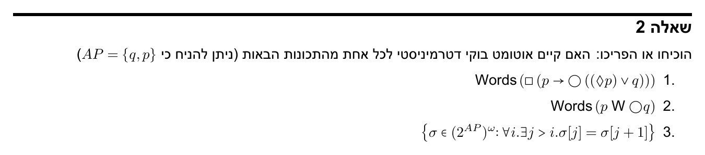

---

# פתרון שאלה 1 — סעיף 1

הנוסחה בשאלה היא <KatexInline math="\square(p \rightarrow \bigcirc(\lozenge p \vee q))" />, וזו שקולה ל־<KatexInline math="\varphi = \square(\neg p \vee \bigcirc(\lozenge p \vee q))" /> לפי השקילות <KatexInline math="p \rightarrow \psi \equiv \neg p \vee \psi" />. לכן קיים עבורה אוטומט Büchi דטרמיניסטי:

<AutomatonD3 variant="classic" :width="420" :height="140" :arrowSize="4" :stateLabelFontSize="14" :transitionLabelFontSize="13"
  :states="[
    { id: 'q0', x: 75, y: 70, label: '$0$', initial: true, initialDirection: 'left', accepting: true, r: 18, labelWidth: 40 },
    { id: 'q1', x: 215, y: 70, label: '$1$', accepting: true, r: 18, labelWidth: 40 },
    { id: 'q2', x: 355, y: 70, label: '$2$', r: 18, labelWidth: 40 }
  ]"
  :transitions="[
    { source: 'q0', target: 'q0', label: '$\\neg p$', loopDirection: '-90deg', labelWidth: 50, labelY: -8 },
    { source: 'q1', target: 'q1', label: '$p$', loopDirection: '-90deg', labelWidth: 35, labelY: -8 },
    { source: 'q2', target: 'q2', label: '$\\neg p$', loopDirection: '-90deg', labelWidth: 50, labelY: -8  },
    { source: 'q0', target: 'q1', label: '$p$', curve: 0.3, labelY: 10, labelWidth: 25 },
    { source: 'q1', target: 'q0', label: '$\\neg p \\wedge q$', curve: 0.3, labelY: -12, labelWidth: 80 },
    { source: 'q1', target: 'q2', label: '$\\neg p \\wedge \\neg q$', curve: 0.3, labelY: 10, labelWidth: 85 },
    { source: 'q2', target: 'q1', label: '$p$', curve: 0.3, labelY: -12, labelWidth: 25 }
  ]"
/>

כל פעם ש־<KatexInline math="p" /> מתקיים במצב <KatexInline math="i" />, נפתחת "חובה": במצב <KatexInline math="i+1" /> צריך <KatexInline math="q" />, **או** ש־<KatexInline math="p" /> יחזור בעתיד (<KatexInline math="\lozenge p" />). כל מצב מייצג את מידת החוב הפתוח:
**0 (מקבל)** — אין חוב; <KatexInline math="p" /> פותח חוב ← 1.
**1 (מקבל)** — חוב חדש, <KatexInline math="q" /> עדיין רלוונטי: <KatexInline math="\neg p \wedge q" /> סוגר ← 0; <KatexInline math="\neg p \wedge \neg q" /> מעביר להמתנה ← 2; <KatexInline math="p" /> סוגר וגם פותח חוב חדש (נשארים ב-1).
**2 (לא מקבל)** — ממתינים רק ל־<KatexInline math="\lozenge p" /> (<KatexInline math="q" /> לא רלוונטי יותר); <KatexInline math="p" /> סוגר וחוזר ← 1.
תנאי הקבלה (ביקור אינסופי ב-0/1) = כל חוב נסגר בזמן סופי; היתקעות לנצח ב-2 (אין עוד <KatexInline math="p" />) נדחית, כמו אי-קיום <KatexInline math="\varphi" />.

---

# פתרון שאלה 1 — סעיף 2

גם עבור <KatexInline math="\varphi = p \, \mathsf{W} \, \bigcirc q" /> (כאשר <KatexInline math="\mathsf{W}" /> היא ה-Weak Until) קיים אוטומט דטרמיניסטי:

<AutomatonD3 variant="classic" :width="440" :height="230" :arrowSize="4" :stateLabelFontSize="14" :transitionLabelFontSize="13"
  :states="[
    { accepting: true, id: 'q0', x: 70, y: 100, label: '$0$', initial: true, initialDirection: 'left', r: 18, labelWidth: 40 },
    { accepting: true, id: 'q1', x: 230, y: 40, label: '$1$', r: 18, labelWidth: 40 },
    { accepting: true, id: 'q2', x: 230, y: 160, label: '$2$', r: 18, labelWidth: 40 },
    { accepting: true, id: 'q3', x: 380, y: 100, label: '$3$', r: 18, labelWidth: 40 }
  ]"
  :transitions="[
    { source: 'q0', target: 'q1', label: '$\\neg p$', curve: -0.2, labelY: -8, labelWidth: 35 },
    { source: 'q0', target: 'q2', label: '$p$', curve: 0.2, labelY: 8, labelWidth: 25 },
    { source: 'q1', target: 'q3', label: '$q$', curve: -0.2, labelY: -8, labelWidth: 25 },
    { source: 'q2', target: 'q3', label: '$q$', curve: 0.2, labelY: 8, labelWidth: 25 },
    { source: 'q2', target: 'q1', label: '$\\neg p \\wedge \\neg q$', curve: 0, labelX: 36, labelWidth: 80 },
    { source: 'q2', target: 'q2', label: '$p \\wedge \\neg q$', loopDirection: '90deg', labelWidth: 70, labelY: 10 },
    { source: 'q3', target: 'q3', label: '$\\mathit{true}$', loopDirection: '-90deg', labelWidth: 50, labelY: -10 }
  ]"
/>

<KatexInline math="\varphi" /> אומרת: <KatexInline math="p" /> מחזיק עד (כולל) המצב שבו <KatexInline math="q" /> מתקיים במצב הבא, או ש־<KatexInline math="p" /> מחזיק לנצח. מצב 3 הוא "בור מקבל" — ברגע שנכנסים אליו (כי <KatexInline math="q" /> כבר הופיע) הכול מקבל תמיד.
**0 (התחלתי)** — עדיין לא ידוע אם <KatexInline math="p" /> יחזיק במצב זה; <KatexInline math="\neg p" /> ← 1 (בודקים אם זה כבר "המצב הבא" שצריך בו <KatexInline math="q" />), <KatexInline math="p" /> ← 2 (עדיין בתוך שרשרת ה-<KatexInline math="p" />).
**1** — כאן בודקים <KatexInline math="q" />: אם מתקיים ← 3 (התקבלנו); אחרת אין מעבר מוגדר — נדחה (הפרה של <KatexInline math="\varphi" />).
**2** — בתוך שרשרת ה-<KatexInline math="p" />: <KatexInline math="p \wedge \neg q" /> נשארים (השרשרת ממשיכה), <KatexInline math="\neg p \wedge \neg q" /> ← 1 (השרשרת נגמרה, בודקים אם זה כן "המצב הבא"), <KatexInline math="q" /> ← 3 (התקבלנו מוקדם).
**3** — בור מקבל, נשארים בו לנצח.

---

# פתרון שאלה 1 — סעיף 3

גם לשפה <KatexInline math="\{\sigma \in (2^{AP})^\omega : \forall i . \exists j > i . \sigma[j] = \sigma[j+1]\}" /> (אינסוף חזרות עוקבות) קיים אוטומט Büchi דטרמיניסטי — הכי נוח לתאר אותו ישירות מתמטית. המצב הוא פשוט התו האחרון שנקרא (איבר של <KatexInline math="2^{AP}" />), חוץ ממצב התחלה ייעודי:

<KatexInline math="Q = 2^{AP} \cup \{q_0\}" /> &nbsp; (<KatexInline math="q_0 \notin 2^{AP}" /> מצב התחלה)

<KatexInline math="F = \{q_0\}" />

<KatexInline math="\delta(A,B) = \begin{cases} q_0 & A = B \\ B & A \neq B \end{cases}" /> &nbsp; לכל <KatexInline math="A \in Q,\, B \in 2^{AP}" />

כלומר: מ־<KatexInline math="q_0" /> תמיד עוברים ל־<KatexInline math="B" /> (זוכרים את התו הראשון). ממצב <KatexInline math="A \in 2^{AP}" />, קריאת אותו תו שוב (<KatexInline math="B=A" />) היא "התאמה" — חזרה עוקבת — ועוברים ל־<KatexInline math="q_0" /> (המצב המקבל); קריאת תו אחר פשוט מעדכנת את הזיכרון ל־<KatexInline math="B" />.

תנאי הקבלה <KatexInline math="\mathrm{Inf}(q_0)" /> — ביקור אינסופי ב־<KatexInline math="q_0" /> — שקול בדיוק לכך שקיימת אינסוף פעמים חזרה עוקבת <KatexInline math="\sigma[j]=\sigma[j+1]" />.

---

# שאלה 2 — מבחן מועד א', 2022, שאלה 3

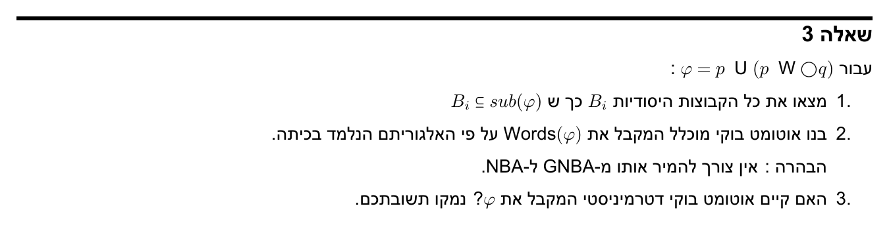

---

# פתרון שאלה 2 — המרה לנוסחה עם U בלבד

האלגוריתם לבניית ה-GNBA (סגור, קבוצות עקביות) מוגדר רק על <KatexInline math="\wedge, \neg, \bigcirc, \mathsf{U}" />. לכן קודם ממירים את <KatexInline math="\varphi = p\, \mathsf{U}\, (p\, \mathsf{W}\, \bigcirc q)" /> לנוסחה שקולה בלי <KatexInline math="\mathsf{W}" />, לפי הזהויות מההרצאה:

<KatexInline math="\varphi_1 \mathbin{\mathsf{W}} \varphi_2 \equiv (\varphi_1 \mathbin{\mathsf{U}} \varphi_2) \vee \square \varphi_1" />

<KatexInline math="\square \varphi \equiv \neg \lozenge \neg \varphi \equiv \neg(\mathit{true} \mathbin{\mathsf{U}} \neg\varphi)" />

ולכן:

<KatexInline math="p \mathbin{\mathsf{W}} \bigcirc q \;\equiv\; (p \mathbin{\mathsf{U}} \bigcirc q) \vee \neg(\mathit{true} \mathbin{\mathsf{U}} \neg p)" />

<KatexInline math="\varphi \;\equiv\; p \mathbin{\mathsf{U}} \Big[\, (p \mathbin{\mathsf{U}} \bigcirc q) \vee \neg(\mathit{true} \mathbin{\mathsf{U}} \neg p) \,\Big]" />

זוהי הנוסחה שעליה נעבוד מכאן והלאה (בניית <KatexInline math="\operatorname{cl}(\varphi)" /> ומציאת הקבוצות העקביות).

---

# פתרון שאלה 2 — חישוב מצבי האוטומט

נסמן <KatexInline math="\beta = \mathit{true}\,\mathsf{U}\,\neg p" />, <KatexInline math="\alpha = p\,\mathsf{U}\,\bigcirc q" />, <KatexInline math="\psi = \alpha \vee \neg\beta" />, <KatexInline math="\varphi = p\,\mathsf{U}\,\psi" />. <KatexInline math="\operatorname{cl}(\varphi)" /> מכיל את אלה, <KatexInline math="p,q,\bigcirc q,\mathit{true}" /> ושלילותיהם. כלל עקביות ל-<KatexInline math="\chi=\chi_1\,\mathsf{U}\,\chi_2" />: <KatexInline math="\chi_2\in B \Rightarrow \chi\in B" />, <KatexInline math="\chi\in B \Rightarrow (\chi_1\in B \vee \chi_2\in B)" /> — אם <KatexInline math="\chi_1\in B" /> אז <KatexInline math="\chi" /> חופשי (<KatexInline math="{}^*" />), אחרת נקבע. <KatexInline math="\psi" /> נקבע ישירות מ-<KatexInline math="\alpha,\beta" />.

| # | <KatexInline math="p" /> | <KatexInline math="\bigcirc q" /> | <KatexInline math="\alpha" /> | <KatexInline math="\beta" /> | <KatexInline math="\psi" /> | <KatexInline math="\varphi" /> |
|:-:|:-:|:-:|:-:|:-:|:-:|:-:|
| 1 | T | T | T | T* | T | T |
| 2 | T | T | T | F* | T | T |
| 3 | T | F | T* | T* | T | T |
| 4 | T | F | T* | F* | T | T |
| 5 | T | F | F* | T* | F | T* |

| # | <KatexInline math="p" /> | <KatexInline math="\bigcirc q" /> | <KatexInline math="\alpha" /> | <KatexInline math="\beta" /> | <KatexInline math="\psi" /> | <KatexInline math="\varphi" /> |
|:-:|:-:|:-:|:-:|:-:|:-:|:-:|
| 6 | T | F | F* | T* | F | F* |
| 7 | T | F | F* | F* | T | T |
| 8 | F | T | T | T | T | T |
| 9 | F | F | F | T | F | F |

<KatexInline math="{}^*" />=בחירה חופשית. גם <KatexInline math="q" /> הנוכחי הוא ביט חופשי בלתי-תלוי (מופיע רק בתוך <KatexInline math="\bigcirc q" />) — כל שורה מתפצלת ל-2 מצבים, ובסך הכול <KatexInline math="9\times2=18" /> קבוצות עקביות. מצב התחלה חוקי = כל קבוצה עם <KatexInline math="\varphi\in B" /> (כל השורות מלבד 6,9).

---

# פתרון שאלה 2 — מעברים ותנאי הקבלה (GNBA)

**תווית היציאה מ-<KatexInline math="B" />** נקבעת ישירות: <KatexInline math="a \in B \iff a \in \text{התווית}" /> (כאן <KatexInline math="a\in\{p,q\}" />) — כלומר <KatexInline math="B" /> "קורא" בדיוק את <KatexInline math="p,q" /> שהוא מכיל.

**מעבר**: <KatexInline math="B \xrightarrow{\;B\cap AP\;} B'" /> מותר אם"ם <KatexInline math="\bigcirc q \in B \iff q \in B'" /> (זו ההגבלה היחידה — <KatexInline math="\bigcirc q" /> הוא איבר ה-<KatexInline math="\bigcirc" /> היחיד ב-<KatexInline math="\operatorname{cl}(\varphi)" />). כלומר מ-<KatexInline math="B" /> אפשר לעבור לכל אחת מ-9 הקבוצות (מתוך ה-18) שבהן <KatexInline math="q" /> תואם את <KatexInline math="\bigcirc q" /> של <KatexInline math="B" /> — אוטומט לא-דטרמיניסטי לגמרי.

**תנאי קבלה מוכלל** — קבוצת קבלה אחת לכל תת-נוסחת <KatexInline math="\mathsf{U}" /> ב-<KatexInline math="\operatorname{cl}(\varphi)" />:

<KatexInline math="F_\varphi = \{B : \varphi\notin B \;\vee\; \psi\in B\}" />

<KatexInline math="F_\alpha = \{B : \alpha\notin B \;\vee\; \bigcirc q\in B\}" />

<KatexInline math="F_\beta = \{B : \beta\notin B \;\vee\; \neg p\in B\}" />

ריצה מתקבלת אם"ם היא מבקרת בכל אחת מ-<KatexInline math="F_\varphi,F_\alpha,F_\beta" /> אינסוף פעמים. מצבי התחלה = כל <KatexInline math="B" /> עם <KatexInline math="\varphi\in B" />. זהו ה-GNBA המבוקש (אין צורך להמיר ל-NBA).

---

# פתרון שאלה 2 — סעיף 3: האם קיים אוטומט דטרמיניסטי?

**לא.** נציב <KatexInline math="q \equiv \mathit{false}" /> תמיד (הצבה זו היא תכונת בטיחות, ולכן אם היה קיים DBA ל-<KatexInline math="\varphi" /> היה קיים גם לחיתוך שלו איתה):

<KatexInline math="\bigcirc q \equiv \mathit{false} \;\Rightarrow\; \alpha = p\,\mathsf{U}\,\bigcirc q \equiv \mathit{false}" />

<KatexInline math="\psi = \alpha \vee \neg\beta \equiv \neg\beta \equiv \square p" />

<KatexInline math="\varphi \equiv p\,\mathsf{U}\,\square p \;=\; \lozenge\square p" />

כלומר על התת-שפה <KatexInline math="q\equiv \mathit{false}" />, השפה של <KatexInline math="\varphi" /> שקולה בדיוק ל־<KatexInline math="\lozenge\square p" /> ("מתישהו <KatexInline math="p" /> מחזיק לצמיתות") — הדוגמה הקלאסית מההרצאה לתכונה **בלי** אוטומט Büchi דטרמיניסטי (כל DBA שמנחש "עכשיו מתחיל הלעד" יכול תמיד להיות מופרך על ידי הפרה מאוחרת ככל שנרצה של <KatexInline math="p" />).

מאחר שאוטומטים דטרמיניסטיים סגורים לחיתוך עם תכונות בטיחות, אילו קיים DBA ל-<KatexInline math="\varphi" /> היה קיים גם ל-<KatexInline math="\lozenge\square p" /> — סתירה. **לכן לא קיים אוטומט Büchi דטרמיניסטי המקבל את <KatexInline math="\varphi" />.**

---

# שאלה 3 — מבחן מועד ב', 2022, שאלה 2

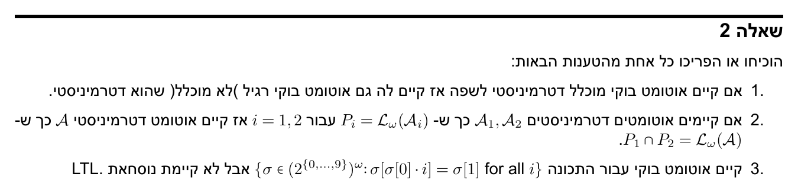

---

# שאלה 4 — מועד א', 2024, שאלה 1

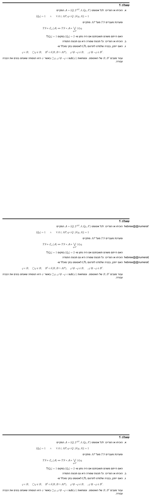

---

# שאלה 5 — מועד א' מילואים, 2024, שאלה 2

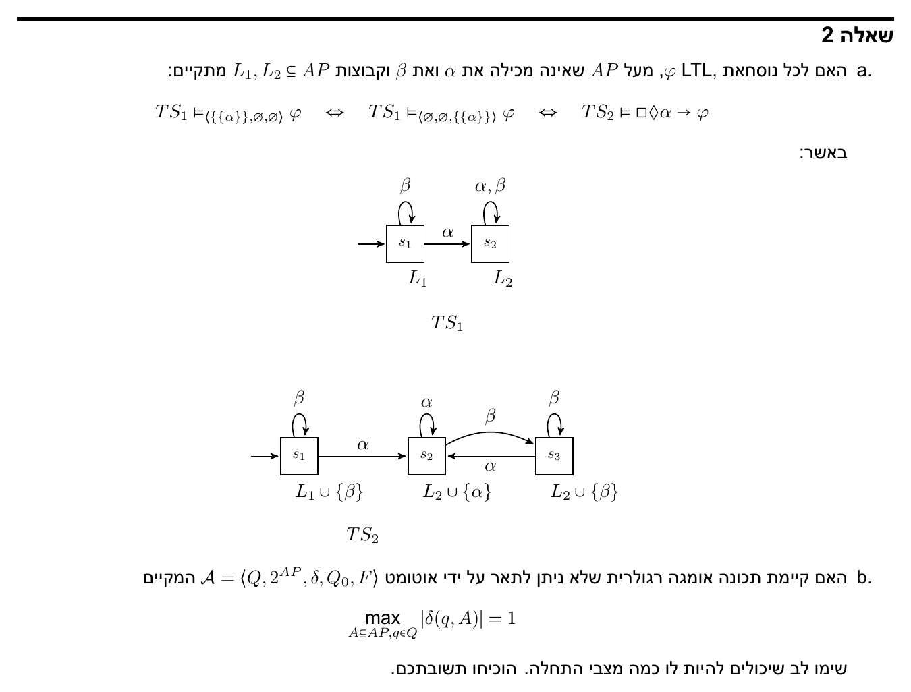

---

# שאלה 6 — מועד ג', 2024, שאלה 1

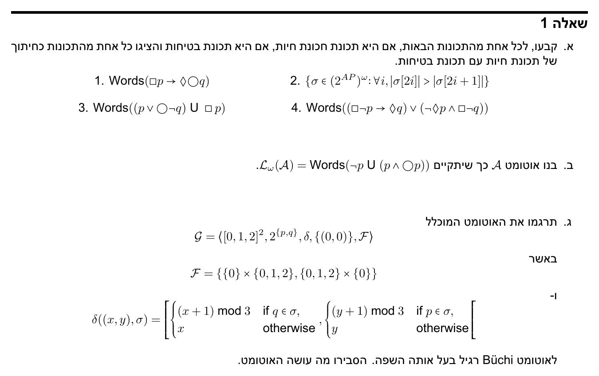

---

# שאלה 7 — מועד ד', 2024, שאלה 3

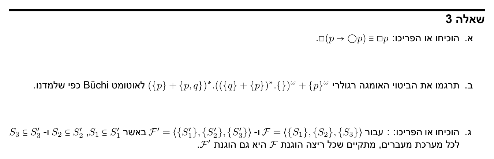

---

# שאלה 8 — מועד ב', 2024, שאלה 2

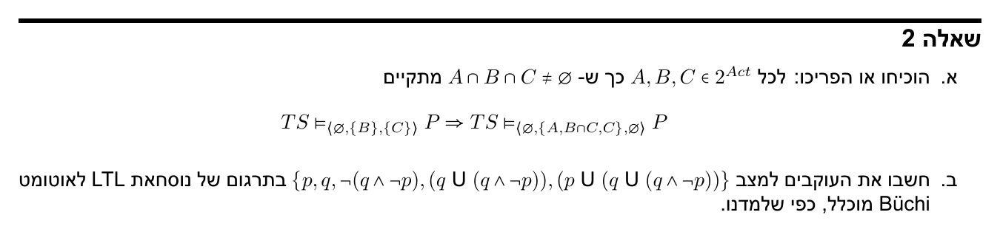

---

# שאלה 9 — מועד ג', 2025, שאלה 3

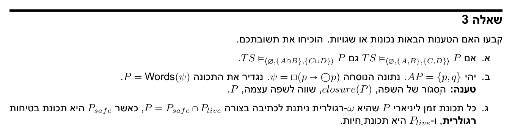

---

# שאלה 10 — מבחן מילואים, 2025, שאלה 1

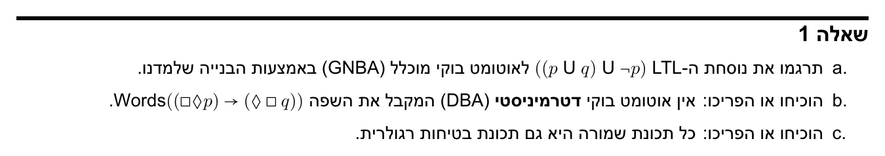

---

# שאלה 11 — מבחן ג', 2022, שאלה 1

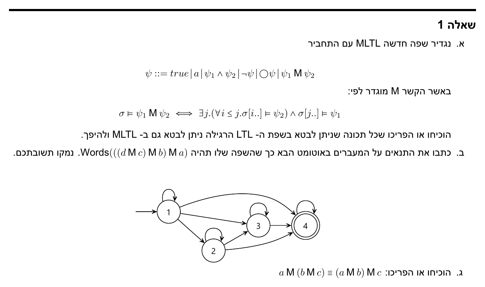

---

# שאלה 12 — מבחן ג', 2022, שאלה 3

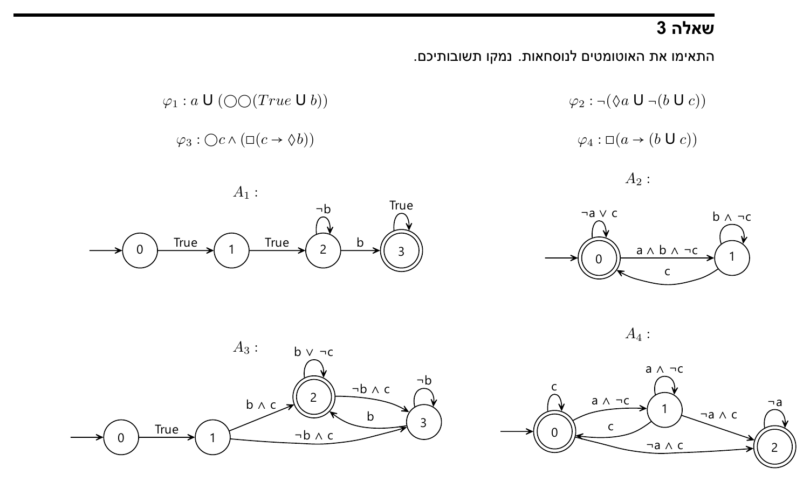

---

# שאלה 13 — מבחן מועד ב', 2022, שאלה 4

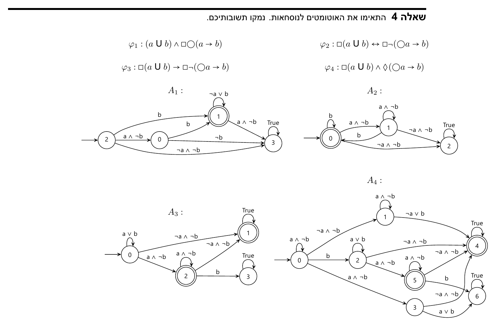

